# ARCHITECTURE.md

## 1. Project Identity

**Name:** `praxis-dashboard` (package name) — **FlowCharge** (product name).
**Version:** 0.1.0.

FlowCharge reads the `flowcharge/` folder inside any project on the local machine and
renders every workstream in it as a card on a Kanban board in the browser, so a developer
can watch what their coding agent is doing to the project's plans, issues and tasks. It
also detects the agentic coding tools installed on the machine and installs the FlowCharge
Core skill suite into them.

**Primary tech stack:** TypeScript 5.9 / Node 20.14+ / `node:http` / zero-runtime-dependency
ES modules / hand-written DOM renderers / esbuild IIFE bundles / Bun single-file executable.

The shipped product is one self-contained CLI binary that starts a loopback HTTP server on
port 4173. It has no framework, no database, no runtime dependency and no build step at run
time. Every board is re-derived from markdown files on every request.

### Architecture Decision Records

| ID | Title | Status | Decision |
| --- | --- | --- | --- |
| ADR-001 | Ship as a CLI binary, not an Electron desktop app | Accepted | FlowCharge ships only as a Bun single-file executable that serves a local web UI; Windows and macOS notarization costs are not worth paying for an unproven app. |
| ADR-002 | Zero runtime dependencies | Accepted | The shipped code uses only Node and browser built-ins, and every entry in `package.json` is a `devDependency`. |
| ADR-003 | Hexagonal ports-and-adapters split | Accepted | `src/ports/` holds import-free type-only contracts, `src/core/` holds the one application service, and `src/lib/` and `src/http/` hold the driven and driving adapters. |
| ADR-004 | Derive the board fresh on every request | Accepted | There is no cache, no database and no snapshot file on the read path, so the board can never be older than the markdown files it renders. |
| ADR-005 | Three separate TypeScript compilations | Accepted | The Node side, the browser side and the Electron side each compile under their own `tsconfig.json`, so DOM types never leak into server code and `@types/node` never leaks into browser code. |
| ADR-006 | Loopback-only by default, with no authentication | Accepted | The server binds `127.0.0.1`, validates the `Host` and `Origin` headers on every request, and gates `/api/integrations/*` on the socket's actual peer address. |
| ADR-007 | Strict Content-Security-Policy with no inline script | Accepted | Every `200` static response carries `script-src 'self'` with no `'unsafe-inline'`, and the bundler fails the build if `eval(` or `Function(` reaches a bundle. |
| ADR-008 | Accept the legacy `prxwork/` tree, prefer `flowcharge/` | Accepted | `resolveTreeLayout` tries `flowcharge/` first and falls back to `prxwork/`, logging one `LEGACY LAYOUT` warning per resolution at the route boundary. |
| ADR-009 | One `window.praxisAPI` surface, two transports | Accepted | The renderer always calls the same `PraxisAPI` method names — six data methods, `getAppVersion`, and an optional `pickProjectFolder`; a browser tab installs a `fetch`-backed shim, and an Electron preload injects a `contextBridge` version. |
| ADR-010 | Anonymous, opt-out telemetry from the packaged binary only | Accepted | One `app_started` event goes to Aptabase carrying a random install ID, version and OS, sent only by the generated CLI entry and never by `npm start` or `npm test`. |
| ADR-011 | Release by local commands across three repositories, not CI | Accepted | CI runs the test job only; the tag, the GitHub Release and the Homebrew formula are cut by three local commands under `.github/scripts/` — `release.mjs`, `publish-release.mjs` and `bump-formula.mjs`, sharing `release-format.mjs` — and none of them pushes. |
| ADR-012 | Hand-roll the zip reader and the YAML parser | Accepted | `zip-read.ts` and `yaml-block.ts` implement only the subset the app needs, so no third-party parser enters the runtime dependency set. |
| ADR-013 | Obfuscate the release bundle and never ship a source map | Accepted | `build:release` minifies and obfuscates each browser bundle, and the asset copier fails the build if any `.map` file is found under `dist/`. |
| ADR-014 | Mirror the Electron IPC handlers against the HTTP routes by hand | Accepted | `electron/agentic-tools-ipc-handlers.cts` cannot import `src/lib` at compile time, so each HTTP handler names the channel it mirrors and the two are changed together. |

## 2. System Boundaries

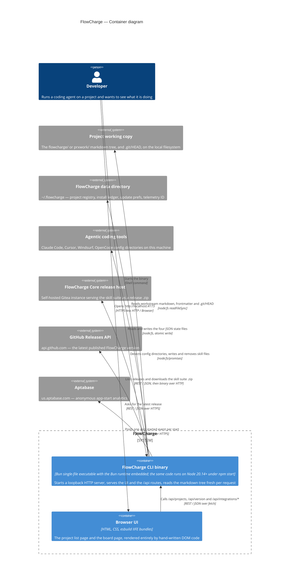
```mermaid
C4Container
    title FlowCharge — Container diagram

    Person(developer, "Developer", "Runs a coding agent on a project and wants to see what it is doing")

    System_Boundary(flowcharge, "FlowCharge") {
        Container(cli, "FlowCharge CLI binary", "Bun single-file executable with the Bun runtime embedded; the same code runs on Node 20.14+ under npm start", "Starts a loopback HTTP server, serves the UI and the /api routes, reads the markdown tree fresh per request")
        Container(browser, "Browser UI", "HTML, CSS, esbuild IIFE bundles", "The project list page and the board page, rendered entirely by hand-written DOM code")
    }

    System_Ext(projectFiles, "Project working copy", "The flowcharge/ or prxwork/ markdown tree, and .git/HEAD, on the local filesystem")
    System_Ext(dataDir, "FlowCharge data directory", "~/.flowcharge — project registry, install ledger, update prefs, telemetry ID")
    System_Ext(codingTools, "Agentic coding tools", "Claude Code, Cursor, Windsurf, OpenCode config directories on this machine")
    System_Ext(gitea, "FlowCharge Core release host", "Self-hosted Gitea instance serving the skill suite as a release .zip")
    System_Ext(github, "GitHub Releases API", "api.github.com — the latest published FlowCharge version")
    System_Ext(aptabase, "Aptabase", "us.aptabase.com — anonymous app-start analytics")

    Rel(developer, browser, "Opens http://localhost:4173", "HTTPS-less HTTP / Browser")
    Rel(browser, cli, "Calls /api/projects, /api/version and /api/integrations/*", "REST / JSON over fetch")
    Rel(developer, cli, "Starts the binary", "Shell command")
    Rel(cli, projectFiles, "Reads workstream markdown, frontmatter and .git/HEAD", "node:fs readFileSync")
    Rel(cli, dataDir, "Reads and writes the four JSON state files", "node:fs, atomic write")
    Rel(cli, codingTools, "Detects config directories, writes and removes skill files", "node:fs/promises")
    Rel(cli, gitea, "Lists releases and downloads the skill suite .zip", "REST / JSON, then binary over HTTP")
    Rel(cli, github, "Asks for the latest release", "REST / JSON over HTTPS")
    Rel(cli, aptabase, "Posts one app_started event per start", "REST / JSON over HTTPS")
```

The browser reaches nothing but the CLI process: the Content-Security-Policy sets
`connect-src 'self'`, so every outbound call in the diagram above is made by the server
process, never by page code.

Two further external systems are reached only at release time, by the maintainer's
own shell and never by the running application: the GitHub Releases API, which
`publishRelease` writes to through the `gh` CLI, and the Homebrew tap working copy,
which `bumpFormula` writes a formula file into.

## 3. Component Architecture

This diagram is the authoritative map of what exists inside FlowCharge. Every component
named here is named identically in Section 4's file manifest, and no file in Section 4
that exports a component, adapter, port or renderer is missing a node here.

```mermaid
C4Component
    title FlowCharge — Component diagram (Level 3)

    Container_Boundary(browserSide, "Browser UI") {
        Component(indexPage, "indexPage", "HTML", "The project-list page shell and the integrations modal markup")
        Component(boardPage, "boardPage", "HTML", "The board page shell, KPI strip, filter row and workstream modal markup")
        Component(stylesheet, "stylesheet", "CSS", "The whole visual system, both themes, as CSS custom properties")
        Component(themeInit, "themeInit", "TypeScript, own bundle", "Applies the stored theme before first paint")
        Component(homeEntry, "homeEntry", "TypeScript, bundled to home.js", "Project tiles, add-project form, integrations modal orchestration")
        Component(boardEntry, "boardEntry", "TypeScript, bundled to app.js", "Board render, filters, dependency chains, detail modal, 5s poll")
        Component(browserIpcShim, "browserIpcShim", "TypeScript", "Installs window.praxisAPI and window.praxisSkillInstallAPI over fetch when absent")
        Component(ipcAdapter, "ipcAdapter", "TypeScript", "PraxisIpcResult, unwrapIpc and the PraxisAPI Window augmentation")
        Component(skillInstallApiTypes, "skillInstallApiTypes", "TypeScript", "Browser-side types for the skill-install surface")
        Component(scopeResolver, "scopeResolver", "TypeScript", "Resolves or rejects a base path for a global or project install scope")
        Component(integrationsChipRules, "integrationsChipRules", "TypeScript, src/lib/, import-free", "Derives one integrations row's eligibility, install chip, version chip, update offer and notes")
        Component(themeStore, "themeStore", "TypeScript", "localStorage mode, resolution to light or dark, the one DOM write")
        Component(themeToggle, "themeToggle", "TypeScript", "Wires the three-button theme control to themeStore")
        Component(appVersionFooter, "appVersionFooter", "TypeScript", "Writes the running version into both page footers")
        Component(updateBanner, "updateBanner", "TypeScript", "Reveals and wires the update banner; inert without an Electron bridge")
    }

    Container_Boundary(nodeSide, "FlowCharge CLI process") {
        Component(cliBootstrap, "cliBootstrap", "TypeScript", "Sets PRAXIS_APP_VERSION and PRAXIS_DATA_DIR and creates the data directory")
        Component(serverBootstrap, "serverBootstrap", "TypeScript", "The composition root: reads env, builds adapters, binds the socket")

        Component(httpDispatcher, "httpDispatcher", "TypeScript", "Builds the http.Server and owns the fixed request pipeline order")
        Component(requestGuards, "requestGuards", "TypeScript", "Host and Origin check, loopback peer check, Content-Type check, name shape rules")
        Component(jsonTransport, "jsonTransport", "TypeScript", "sendJson, the 8KB bounded body reader and the error-message wording")
        Component(staticFiles, "staticFiles", "TypeScript", "MIME table, the CSP header and the path-traversal boundary")
        Component(routesProjects, "routesProjects", "TypeScript", "/api/projects and /api/projects/:id")
        Component(routesBoard, "routesBoard", "TypeScript", "/api/projects/:id/data and .../workstreams/:wsId/detail")
        Component(routesIntegrations, "routesIntegrations", "TypeScript", "The five /api/integrations/* routes behind the loopback gate")

        Component(boardApi, "boardApi", "TypeScript", "The application service; the only orchestration module")

        Component(portAppApi, "portAppApi", "TypeScript, types only", "The driving port: BoardApi and its result variants")
        Component(portProjectRegistry, "portProjectRegistry", "TypeScript, types only", "The driven port for the project registry file")
        Component(portWorkstreamStore, "portWorkstreamStore", "TypeScript, types only", "The driven port for the markdown tree")
        Component(portCliBootstrap, "portCliBootstrap", "TypeScript, types only", "The driven port for the CLI bootstrap step")
        Component(sharedTypes, "sharedTypes", "TypeScript ambient .d.ts", "PraxisData, BoardPayload, ProjectEntry and the detail payload shapes")

        Component(projectRegistryAdapter, "projectRegistryAdapter", "TypeScript", "Owns .praxis-projects.json: the ProjectRegistry adapter factory plus a module-scope default instance")
        Component(workstreamStoreAdapter, "workstreamStoreAdapter", "TypeScript", "Implements WorkstreamStore over the four markdown libraries")
        Component(treeLayout, "treeLayout", "TypeScript", "Resolves a project root to flowcharge/ or legacy prxwork/")
        Component(boardExtractor, "boardExtractor", "TypeScript", "Walks the tree and returns the PraxisData board payload")
        Component(detailExtractor, "detailExtractor", "TypeScript", "Reads one workstream's plan, issue and task artefacts")
        Component(yamlBlock, "yamlBlock", "TypeScript", "Parser for the small YAML subset inside artefact fences")
        Component(gitBranchReader, "gitBranchReader", "TypeScript", "Reads .git/HEAD and returns the branch name or null")

        Component(toolCatalogue, "toolCatalogue", "TypeScript, data only", "Per-tool facts for Claude Code, Cursor, Windsurf and OpenCode")
        Component(toolSignals, "toolSignals", "TypeScript", "The FsAccess port and the two category detection rules")
        Component(toolDetect, "toolDetect", "TypeScript", "Dispatches each catalogue entry to its category signal function")
        Component(installFormat, "installFormat", "TypeScript", "Picks a format and turns InstallContent into concrete FileWrites")
        Component(installContent, "installContent", "TypeScript", "The InstallContent shape and its change-detection hash")
        Component(installEngine, "installEngine", "TypeScript", "Turns one InstallTarget plus content into filesystem writes")
        Component(installTracking, "installTracking", "TypeScript", "Pure parse, upsert, find and remove over the InstallRecord ledger")
        Component(skillPresence, "skillPresence", "TypeScript", "Read-only presence probe for the canonical skill suite")
        Component(skillVersion, "skillVersion", "TypeScript", "Read-only reader of metadata.version out of an installed SKILL.md")
        Component(canonicalSkills, "canonicalSkills", "TypeScript, data only", "The hand-maintained canonical FlowCharge Core skill id list")
        Component(fsAdapter, "fsAdapter", "TypeScript", "Concrete FsAccess and FsWriteAccess over node:fs/promises")

        Component(skillContentFetch, "skillContentFetch", "TypeScript", "Downloads the newest release .zip and returns it as InstallContent")
        Component(skillReleaseFetch, "skillReleaseFetch", "TypeScript", "Knows the release API JSON shape and builds its two URLs")
        Component(zipRead, "zipRead", "TypeScript", "Hand-rolled zip container reader over node:zlib")

        Component(updateCheck, "updateCheck", "TypeScript", "Asks the releases API for the latest version and compares semvers")
        Component(updatePrefs, "updatePrefs", "TypeScript", "Owns .praxis-update.json")
        Component(telemetry, "telemetry", "TypeScript", "Opt-out check, Aptabase wire contract and the one outbound POST")
        Component(telemetryInstallId, "telemetryInstallId", "TypeScript", "Owns .praxis-telemetry.json and the random install ID")

        Component(extractCli, "extractCli", "TypeScript", "A thin argv wrapper that dumps a tree to JSON")
    }

    Container_Boundary(buildSide, "Build and release tooling") {
        Component(copyAssets, "copyAssets", "Node ESM", "Copies HTML, CSS and images to dist/public and refuses source maps")
        Component(bundlePublic, "bundlePublic", "Node ESM", "esbuild IIFE bundles, optional obfuscation, and the eval guard")
        Component(packageCli, "packageCli", "Node ESM", "Generates dist/cli-entry.js and runs bun build --compile per target")
        Component(releaseCmd, "releaseCmd", "Node ESM", "Refuses a bad state, builds the binaries, cuts the annotated tag")
        Component(publishRelease, "publishRelease", "Node ESM", "Attaches the binaries to a GitHub Release via gh")
        Component(bumpFormula, "bumpFormula", "Node ESM", "Regenerates the Homebrew formula from the built binaries")
        Component(releaseFormat, "releaseFormat", "Node ESM", "Owns the X.Y.Z string and the CHANGELOG heading shape")
    }

    Container_Boundary(electronSide, "Electron scaffolding (built, not shipped)") {
        Component(electronMain, "electronMain", "CommonJS TypeScript", "Starts the compiled server and opens a BrowserWindow at its port")
        Component(electronPreload, "electronPreload", "CommonJS TypeScript", "Exposes the four window.praxis* surfaces via contextBridge")
        Component(electronIpcHandlers, "electronIpcHandlers", "CommonJS TypeScript", "Relays window.praxisAPI calls to the /api routes over loopback")
        Component(electronToolsIpc, "electronToolsIpc", "CommonJS TypeScript", "Loads nine src/lib modules by dynamic import; hand-mirrors routesIntegrations")
        Component(electronUpdateIpc, "electronUpdateIpc", "CommonJS TypeScript", "Owns the whole update-check policy and answers four channels")
        Component(electronThemeIpc, "electronThemeIpc", "CommonJS TypeScript", "Assigns nativeTheme.themeSource for the native chrome")
    }

    Rel(indexPage, themeInit, "loads in head", "script src")
    Rel(indexPage, homeEntry, "loads at body end", "script src")
    Rel(boardPage, themeInit, "loads in head", "script src")
    Rel(boardPage, boardEntry, "loads at body end", "script src")
    Rel(indexPage, stylesheet, "styles", "link rel")
    Rel(boardPage, stylesheet, "styles", "link rel")
    Rel(themeInit, themeStore, "direct import", "ES module")
    Rel(themeToggle, themeStore, "direct import", "ES module")
    Rel(homeEntry, browserIpcShim, "side-effect import, first", "ES module")
    Rel(boardEntry, browserIpcShim, "side-effect import, first", "ES module")
    Rel(homeEntry, appVersionFooter, "side-effect import", "ES module")
    Rel(boardEntry, appVersionFooter, "side-effect import", "ES module")
    Rel(homeEntry, updateBanner, "side-effect import", "ES module")
    Rel(boardEntry, updateBanner, "side-effect import", "ES module")
    Rel(homeEntry, themeToggle, "side-effect import", "ES module")
    Rel(boardEntry, themeToggle, "side-effect import", "ES module")
    Rel(homeEntry, ipcAdapter, "unwrapIpc import", "ES module")
    Rel(boardEntry, ipcAdapter, "unwrapIpc import", "ES module")
    Rel(homeEntry, scopeResolver, "resolveBasePathForScope import", "ES module")
    Rel(homeEntry, integrationsChipRules, "deriveIntegrationsRowDecision import", "ES module")
    Rel(homeEntry, skillInstallApiTypes, "type import", "ES module")
    Rel(browserIpcShim, ipcAdapter, "type import only", "ES module")
    Rel(browserIpcShim, httpDispatcher, "GET, POST, PATCH, DELETE on /api/*", "fetch / JSON")
    Rel(electronPreload, electronIpcHandlers, "invokes eight channels", "ipcRenderer.invoke")
    Rel(electronPreload, electronToolsIpc, "invokes six channels", "ipcRenderer.invoke")
    Rel(electronPreload, electronUpdateIpc, "invokes four channels", "ipcRenderer.invoke")
    Rel(electronPreload, electronThemeIpc, "invokes one channel", "ipcRenderer.invoke")
    Rel(electronMain, serverBootstrap, "awaits serverReady", "dynamic import")
    Rel(electronMain, electronIpcHandlers, "registerIpcHandlers", "direct import")
    Rel(electronMain, electronToolsIpc, "registerAgenticToolsIpcHandlers", "direct import")
    Rel(electronMain, electronUpdateIpc, "registerUpdateCheckIpcHandlers", "direct import")
    Rel(electronMain, electronThemeIpc, "registerThemeIpcHandlers", "direct import")
    Rel(electronIpcHandlers, electronMain, "reads SERVER_URL", "direct import")
    Rel(electronIpcHandlers, httpDispatcher, "relays every call", "loopback HTTP")
    Rel(electronToolsIpc, installEngine, "installToTarget, removeInstallation", "dynamic import")
    Rel(electronToolsIpc, installTracking, "parseInstallRegistry, findInstallRecord", "dynamic import")
    Rel(electronToolsIpc, projectRegistryAdapter, "readProjects", "dynamic import")
    Rel(electronToolsIpc, fsAdapter, "createNodeFsWriteAccess, createNodeFsAccess", "dynamic import")
    Rel(electronToolsIpc, toolCatalogue, "TOOL_CATALOGUE", "dynamic import")
    Rel(electronToolsIpc, toolDetect, "detectAllTools", "dynamic import")
    Rel(electronToolsIpc, skillPresence, "checkSkillPresence", "dynamic import")
    Rel(electronToolsIpc, canonicalSkills, "CANONICAL_PRAXIS_SKILL_IDS", "dynamic import")
    Rel(electronToolsIpc, skillContentFetch, "getInstallContent, listSkillReleases", "dynamic import")
    Rel(electronUpdateIpc, updateCheck, "calls in-process", "dynamic import")
    Rel(electronUpdateIpc, updatePrefs, "calls in-process", "dynamic import")

    Rel(cliBootstrap, portCliBootstrap, "implements", "type contract")
    Rel(serverBootstrap, httpDispatcher, "createHttpServer(config)", "direct import")
    Rel(serverBootstrap, boardApi, "createBoardApi(deps)", "direct import")
    Rel(serverBootstrap, projectRegistryAdapter, "createJsonFileProjectRegistry", "direct import")
    Rel(serverBootstrap, workstreamStoreAdapter, "createMarkdownWorkstreamStore", "direct import")
    Rel(serverBootstrap, fsAdapter, "createNodeFsAccess and createNodeFsWriteAccess", "direct import")
    Rel(serverBootstrap, boardExtractor, "ID_SUFFIX constant only", "direct import")

    Rel(httpDispatcher, requestGuards, "passesOriginCheck, isJsonContentType", "direct import")
    Rel(httpDispatcher, staticFiles, "resolveStaticPath, serveStaticFile", "direct import")
    Rel(httpDispatcher, jsonTransport, "sendJson", "direct import")
    Rel(httpDispatcher, routesProjects, "handleProjectRoutes", "direct import")
    Rel(httpDispatcher, routesBoard, "handleBoardRoutes", "direct import")
    Rel(httpDispatcher, routesIntegrations, "handleIntegrationsRoutes", "direct import")
    Rel(routesProjects, portAppApi, "calls through BoardApi", "injected interface")
    Rel(routesBoard, portAppApi, "calls through BoardApi", "injected interface")
    Rel(routesProjects, routesBoard, "warnLegacyLayout", "direct import")
    Rel(routesProjects, jsonTransport, "sendJson, readRequestBody", "direct import")
    Rel(routesProjects, requestGuards, "MAX_NAME_LENGTH, CONTROL_CHARS", "direct import")
    Rel(routesBoard, jsonTransport, "sendJson", "direct import")
    Rel(routesIntegrations, jsonTransport, "sendJson, readRequestBody, errorMessage", "direct import")
    Rel(routesIntegrations, requestGuards, "isLoopbackRemote", "direct import")
    Rel(routesIntegrations, portProjectRegistry, "list() for permitted roots", "injected interface")
    Rel(routesIntegrations, toolDetect, "detectAllTools", "direct import")
    Rel(routesIntegrations, toolCatalogue, "TOOL_CATALOGUE lookup", "direct import")
    Rel(routesIntegrations, installEngine, "installToTarget, removeInstallation, recordedInstallPaths", "direct import")
    Rel(routesIntegrations, installTracking, "parseInstallRegistry, findInstallRecord", "direct import")
    Rel(routesIntegrations, skillPresence, "checkSkillPresence", "direct import")
    Rel(routesIntegrations, skillVersion, "readInstalledSkillVersion", "direct import")
    Rel(routesIntegrations, canonicalSkills, "CANONICAL_PRAXIS_SKILL_IDS", "direct import")
    Rel(routesIntegrations, skillContentFetch, "getInstallContent, listSkillReleases", "direct import")

    Rel(boardApi, portAppApi, "implements", "type contract")
    Rel(boardApi, portProjectRegistry, "list, find, add, remove, rename", "injected interface")
    Rel(boardApi, portWorkstreamStore, "resolveLayout, hasTree, readBoard, readDetail, readBranch", "injected interface")
    Rel(projectRegistryAdapter, portProjectRegistry, "implements", "type contract")
    Rel(workstreamStoreAdapter, portWorkstreamStore, "implements", "type contract")
    Rel(workstreamStoreAdapter, treeLayout, "resolveTreeLayout, hasWorkstreamTree", "direct import")
    Rel(workstreamStoreAdapter, boardExtractor, "extractPraxisData", "direct import")
    Rel(workstreamStoreAdapter, detailExtractor, "extractWorkstreamDetail", "direct import")
    Rel(workstreamStoreAdapter, gitBranchReader, "readBranch", "direct import")
    Rel(boardExtractor, treeLayout, "resolveTreeLayout, isWorkstreamMarker", "direct import")
    Rel(detailExtractor, treeLayout, "resolveTreeLayout, isWorkstreamMarker", "direct import")
    Rel(detailExtractor, boardExtractor, "parseFrontmatter, artefactIdNumber, item patterns", "direct import")
    Rel(detailExtractor, yamlBlock, "parseYamlBlock", "direct import")
    Rel(extractCli, boardExtractor, "extractPraxisData", "direct import")
    Rel(extractCli, treeLayout, "resolveTreeLayout, prints its own LEGACY LAYOUT line", "direct import")

    Rel(toolDetect, toolCatalogue, "iterates ToolDefinition rows", "direct import")
    Rel(toolDetect, toolSignals, "cli and guiApp dispatch", "direct import")
    Rel(toolSignals, toolCatalogue, "reads OsPath rows", "direct import")
    Rel(skillPresence, toolSignals, "FsAccess.pathExists", "injected interface")
    Rel(skillPresence, installFormat, "selectPrimaryFormat, formatForTarget", "direct import")
    Rel(skillVersion, toolSignals, "FsAccess.readTextFile", "injected interface")
    Rel(skillVersion, installFormat, "selectPrimaryFormat, formatForTarget", "direct import")
    Rel(skillVersion, yamlBlock, "parseYamlBlock", "direct import")
    Rel(installEngine, installFormat, "selectPrimaryFormat, formatForTarget", "direct import")
    Rel(installEngine, installContent, "hashInstallContent", "direct import")
    Rel(installEngine, installTracking, "upsert, find and remove records", "direct import")
    Rel(installEngine, fsAdapter, "FsWriteAccess", "injected interface")
    Rel(installFormat, toolCatalogue, "reads IntegrationFormat rows", "direct import")
    Rel(skillContentFetch, skillReleaseFetch, "fetchReleases, buildAssetDownloadUrl", "direct import")
    Rel(skillContentFetch, zipRead, "parseZip", "direct import")
    Rel(skillContentFetch, fsAdapter, "temporary file write and read-back", "injected interface")
    Rel(telemetry, telemetryInstallId, "readOrCreateInstallId", "direct import")

    Rel(copyAssets, stylesheet, "copies to dist/public", "node:fs")
    Rel(bundlePublic, homeEntry, "esbuild entry point", "bundle")
    Rel(bundlePublic, boardEntry, "esbuild entry point", "bundle")
    Rel(bundlePublic, themeInit, "esbuild entry point", "bundle")
    Rel(packageCli, cliBootstrap, "generated entry calls applyCliDefaults", "generated import")
    Rel(packageCli, serverBootstrap, "generated entry dynamically imports", "generated import")
    Rel(packageCli, telemetry, "generated entry calls trackAppStarted last", "generated import")
    Rel(releaseCmd, packageCli, "runs npm run package:cli", "child process")
    Rel(releaseCmd, releaseFormat, "isBareVersion, newestVersion", "direct import")
    Rel(publishRelease, releaseFormat, "sectionBody", "direct import")
    Rel(bumpFormula, releaseFormat, "isBareVersion", "direct import")
```

## 4. File & Directory Manifest

Every file below carries the name of the Section 3 component it holds, where it holds one.
`dist/` and `release/` are build outputs, are gitignored, and are listed here as generated
directories rather than as authored files.

```
./
├── ARCHITECTURE.md                          # This document — the whole-of-system architecture
├── CLAUDE.md                                # Project facts binding on agents: CLI-only, product naming, licence
├── DEVELOPMENT.md                           # Build, test, environment variables and the four-step release process
├── README.md                                # What FlowCharge is, install, telemetry disclosure
├── SECURITY.md                              # Vulnerability reporting policy and disclosure window
├── package.json                             # Scripts, devDependencies, engines, electron-builder block
├── tsconfig.json                            # The Node-side compilation: src/server.ts, core, http, lib, ports, scripts, test, types
├── bun.lock                                 # The only committed lockfile; no package-lock.json exists, so ci.yml's npm ci has nothing to read
├── .gitignore                               # dist/, release/, the four .praxis-*.json state files, the generated index, board and ids/
├── flowcharge-theme-toggle.gif              # README screencast of the board and the theme toggle
│
├── .claude/
│   └── launch.json                          # Local dev-server launch configuration
│
├── .github/
│   ├── workflows/
│   │   └── ci.yml                           # The single test job; no release job by design
│   └── scripts/
│       ├── release-format.mjs               # releaseFormat — the X.Y.Z string and the CHANGELOG heading shape
│       ├── release-format.test.mjs          # Tests for releaseFormat, run from source
│       ├── release.mjs                      # releaseCmd — refuses, builds, tags in flowcharge-public
│       ├── release.test.mjs                 # Tests for releaseCmd
│       ├── publish-release.mjs              # publishRelease — the one outward-facing gh call
│       ├── publish-release.test.mjs         # Tests for publishRelease
│       ├── bump-formula.mjs                 # bumpFormula — regenerates Formula/flowcharge.rb in the tap
│       └── bump-formula.test.mjs            # Tests for bumpFormula
│
├── src/
│   ├── server.ts                            # serverBootstrap — the composition root and the socket bind
│   ├── cli-bootstrap.ts                     # cliBootstrap — the packaged binary's two environment defaults
│   │
│   ├── core/
│   │   └── board-api.ts                     # boardApi — the application service over the two driven ports
│   │
│   ├── ports/
│   │   ├── app-api.ts                       # portAppApi — the driving port and its result variants
│   │   ├── project-registry.ts              # portProjectRegistry — the registry contract and its config
│   │   ├── workstream-store.ts              # portWorkstreamStore — the markdown-tree contract and TreeLayout
│   │   └── cli-bootstrap.ts                 # portCliBootstrap — the bootstrap input and result contract
│   │
│   ├── http/
│   │   ├── create-server.ts                 # httpDispatcher — builds http.Server and owns the pipeline order
│   │   ├── guards.ts                        # requestGuards — Host, Origin, loopback peer, Content-Type, name shape
│   │   ├── json.ts                          # jsonTransport — sendJson, the 8KB body reader, errorMessage
│   │   ├── static-files.ts                  # staticFiles — MIME table, CSP header, traversal boundary
│   │   ├── routes-projects.ts               # routesProjects — /api/projects and /api/projects/:id
│   │   ├── routes-board.ts                  # routesBoard — the board payload and workstream detail routes
│   │   └── routes-integrations.ts           # routesIntegrations — the five /api/integrations/* routes
│   │
│   ├── lib/
│   │   ├── projects.ts                      # projectRegistryAdapter — owns .praxis-projects.json
│   │   ├── workstream-store.ts              # workstreamStoreAdapter — WorkstreamStore over the markdown libraries
│   │   ├── tree-layout.ts                   # treeLayout — flowcharge/ preferred, prxwork/ legacy fallback
│   │   ├── extract.ts                       # boardExtractor — frontmatter walk to the PraxisData payload
│   │   ├── detail.ts                        # detailExtractor — one workstream's plan, issues and tasks
│   │   ├── yaml-block.ts                    # yamlBlock — the small YAML subset parser
│   │   ├── git.ts                           # gitBranchReader — .git/HEAD to a branch name or null
│   │   ├── telemetry.ts                     # telemetry — opt-out check, Aptabase contract, the one POST
│   │   ├── telemetry-install-id.ts          # telemetryInstallId — owns .praxis-telemetry.json
│   │   ├── update-check.ts                  # updateCheck — latest-release lookup and semver comparison
│   │   ├── update-prefs.ts                  # updatePrefs — owns .praxis-update.json
│   │   ├── skill-content-fetch.ts           # skillContentFetch — release .zip to InstallContent
│   │   ├── skill-release-fetch.ts           # skillReleaseFetch — the release API JSON shape and its URLs
│   │   ├── zip-read.ts                      # zipRead — hand-rolled zip container reader over node:zlib
│   │   ├── agentic-tools-catalogue.ts       # toolCatalogue — per-tool facts, data only
│   │   ├── agentic-tools-signals.ts         # toolSignals — the FsAccess port and the two category rules
│   │   ├── agentic-tools-detect.ts          # toolDetect — catalogue iteration and category dispatch
│   │   ├── agentic-tools-format.ts          # installFormat — format selection and FileWrite construction
│   │   ├── agentic-tools-content.ts         # installContent — the content shape and its hash
│   │   ├── agentic-tools-install.ts         # installEngine — one target plus content to filesystem writes
│   │   ├── agentic-tools-install-tracking.ts # installTracking — pure operations over the InstallRecord ledger
│   │   ├── agentic-tools-skill-presence.ts  # skillPresence — read-only presence probe
│   │   ├── agentic-tools-skill-version.ts   # skillVersion — metadata.version out of an installed SKILL.md
│   │   ├── agentic-tools-canonical-skills.ts # canonicalSkills — the hand-maintained skill id list
│   │   ├── agentic-tools-chip-rules.ts      # integrationsChipRules — the integrations row decision; import-free,
│   │   │                                    #   compiled by the Node project and by src/public/tsconfig.json
│   │   └── agentic-tools-fs-adapter.ts      # fsAdapter — FsAccess and FsWriteAccess over node:fs/promises
│   │
│   ├── scripts/
│   │   └── extract-praxis-data.ts           # extractCli — argv wrapper that dumps a tree to JSON
│   │
│   ├── types/
│   │   └── praxis-data.d.ts                 # sharedTypes — ambient globals for both compilations
│   │
│   ├── public/
│   │   ├── tsconfig.json                    # The browser-side compilation: DOM libs, no Node types, noEmit
│   │   ├── index.html                       # indexPage — the project list and integrations modal
│   │   ├── board.html                       # boardPage — the board, KPI strip and workstream modal
│   │   ├── styles.css                       # stylesheet — the whole visual system in both themes
│   │   ├── theme-init.ts                    # themeInit — pre-paint theme application, its own bundle
│   │   ├── home.ts                          # homeEntry — the index.html entry module
│   │   ├── app.ts                           # boardEntry — the board.html entry module
│   │   ├── browser-ipc-shim.ts              # browserIpcShim — the fetch-backed window.praxis* fallback
│   │   ├── ipc-adapter.ts                   # ipcAdapter — PraxisIpcResult, unwrapIpc, the PraxisAPI surface
│   │   ├── theme.ts                         # themeStore — stored mode, resolution, the one DOM write
│   │   ├── theme-toggle.ts                  # themeToggle — the three-button control
│   │   ├── app-version.ts                   # appVersionFooter — writes the version into both footers
│   │   ├── update-banner.ts                 # updateBanner — the banner, inert without an Electron bridge
│   │   ├── lib/
│   │   │   ├── agentic-tools-api.ts         # skillInstallApiTypes — browser-side install surface types
│   │   │   └── agentic-tools-scope.ts       # scopeResolver — base-path resolution per install scope
│   │   ├── img/
│   │   │   ├── flowcharge-wordmark.png      # Wordmark, copied into dist/public by copyAssets
│   │   │   ├── flowcharge-mark.png          # Mark, copied into dist/public by copyAssets
│   │   │   └── flowcharge-lockup-2.png      # Lockup, tracked but not copied and not referenced
│   │   └── fonts/
│   │       ├── Snasm Lt.otf                 # Tracked but not copied and not referenced by styles.css
│   │       └── Snasm Lt It.otf              # Tracked but not copied and not referenced by styles.css
│   │
│   └── test/
│       ├── fixture-project.ts               # Shared workstream-tree fixture builder; carries no .test. segment
│       ├── expected-skill-ids.ts            # Golden canonical skill id literal; carries no .test. segment
│       ├── boundary/
│       │   ├── server-harness.ts            # Starts the compiled server on an ephemeral port in a temp data dir
│       │   ├── server-board.test.ts         # Board and detail routes over real HTTP
│       │   ├── server-guards.test.ts        # Host, Origin, Content-Type, traversal and loopback gate order
│       │   ├── server-projects.test.ts      # Project registry routes over real HTTP
│       │   └── cli-binary.test.ts           # The packaged Bun binary's behaviour
│       └── unit/
│           ├── server.test.ts               # The /api/integrations/* routes over a real socket
│           ├── server-env-seams.test.ts     # PORT, HOST, ALLOWED_HOSTS, PRAXIS_* seam behaviour
│           ├── board-api.test.ts            # boardApi against stub ports
│           ├── projects.test.ts             # projectRegistryAdapter
│           ├── tree-layout.test.ts          # treeLayout precedence and marker rules
│           ├── extract.test.ts              # boardExtractor
│           ├── detail.test.ts               # detailExtractor
│           ├── zip-read.test.ts             # zipRead
│           ├── update-check.test.ts         # updateCheck
│           ├── update-prefs.test.ts         # updatePrefs
│           ├── telemetry.test.ts            # telemetry
│           ├── telemetry-install-id.test.ts # telemetryInstallId
│           ├── skill-content-fetch.test.ts  # skillContentFetch
│           ├── skill-release-fetch.test.ts  # skillReleaseFetch
│           ├── agentic-tools-catalogue.test.ts        # detectAllTools over the whole catalogue, plus the catalogue data-shape test
│           ├── agentic-tools-signals.test.ts          # toolSignals — the cli category rule
│           ├── agentic-tools-detect.test.ts           # toolDetect — detectTool against the Claude Code entry
│           ├── agentic-tools-format.test.ts           # installFormat
│           ├── agentic-tools-content.test.ts          # installContent
│           ├── agentic-tools-install.test.ts          # installEngine
│           ├── agentic-tools-install-tracking.test.ts # installTracking
│           ├── agentic-tools-skill-presence.test.ts   # skillPresence
│           ├── agentic-tools-skill-version.test.ts    # skillVersion — parseSkillVersion and readInstalledSkillVersion
│           ├── agentic-tools-canonical-skills.test.ts # canonicalSkills — pins the id list against expected-skill-ids.ts
│           ├── agentic-tools-chip-rules.test.ts       # integrationsChipRules — deriveIntegrationsRowDecision's decision table
│           └── agentic-tools-fs-adapter.test.ts       # fsAdapter — createNodeFsWriteAccess against a real temporary directory
│
├── electron/                                # Built by build:base, packaged by no shipped release path
│   ├── tsconfig.json                        # The Electron compilation: CommonJS, node10 resolution
│   ├── main.cts                             # electronMain — starts the server, opens a BrowserWindow
│   ├── preload.cts                          # electronPreload — the four contextBridge surfaces
│   ├── ipc-handlers.cts                     # electronIpcHandlers — loopback relay to the /api routes
│   ├── agentic-tools-ipc-handlers.cts       # electronToolsIpc — in-process install engine bridge
│   ├── update-check-ipc-handlers.cts        # electronUpdateIpc — the whole update-check policy
│   └── theme-ipc-handlers.cts               # electronThemeIpc — nativeTheme.themeSource
│
├── tools/
│   ├── copy-assets.mjs                      # copyAssets — asset copy plus the source-map refusal guard
│   ├── bundle-public.mjs                    # bundlePublic — esbuild, optional obfuscation, the eval guard
│   └── package-cli.mjs                      # packageCli — generates dist/cli-entry.js, runs bun build --compile
│
├── mockups/
│   ├── board-toolbar-mockup.html            # Static design mockup of the board toolbar
│   └── home-toolbar-mockup.html             # Static design mockup of the home toolbar
│
├── flowcharge/                              # This repository's own FlowCharge Core artefact tree
│   ├── agents.md                            # Orchestrator defaults for this project
│   ├── tags.md                              # The tag pool
│   ├── ids.md                               # The global ID registry
│   ├── index.md                             # Generated index (gitignored)
│   ├── kanban.md                            # Generated board (gitignored)
│   ├── ids/                                 # Generated ID markers (gitignored)
│   └── workstreams/                         # One folder per workstream: workstream.md plus its artefacts
│
├── dist/                                    # Build output (gitignored): server.js, cli-bootstrap.js, core/, ports/,
│                                            #   http/, lib/, scripts/, test/, electron/, cli-entry.js and the bundled public/
└── release/
    └── cli/                                 # Bun binaries (gitignored): flowcharge-<version>-<platform>-<arch>
```

Four state files live outside this tree, in `PRAXIS_DATA_DIR` — the repository root during
development, and `~/.flowcharge` in the packaged binary: `.praxis-projects.json`,
`.praxis-installs.json`, `.praxis-update.json` and `.praxis-telemetry.json`. All four
are listed in `.gitignore`. Two untracked Pixelmator `.pxd` bundles sit
under `src/public/img/`; they are design working files, neither tracked nor built.

## 5. Data & Type Definitions

These diagrams together are the authoritative type contract. They are split by subject
only, for legibility; every type the application defines appears in exactly one of them,
and every type named in Section 8's Data/Contract column is defined here. Four files
carry hand-maintained structural mirrors of types declared elsewhere rather than
imports — `skillContentFetch` mirrors `SkillContent` and `InstallContent`,
`skillInstallApiTypes` mirrors the detection, install-record, release-summary and
presence shapes for the browser, `integrationsChipRules` mirrors `SkillPresenceResult`
as `SkillPresenceLike` and the scope kind as `IntegrationsScopeKind` because it may
carry no import at all, and the Electron IPC handlers mirror everything they use — and
each mirror is drawn once here, under the module that owns the original.

### 5.1 Board domain payload and ports


```mermaid
classDiagram
    class PraxisArtefact {
        <<interface>>
        +id string
        +type string
        +status string
        +updated string
        +total number optional
        +done number optional
    }

    class PraxisWorkstream {
        <<interface>>
        +id string
        +slug string
        +title string
        +status string
        +tags string[]
        +created string
        +updated string
        +depends_on string[]
        +body string
        +archived boolean
        +artefacts PraxisArtefact[]
        +description string optional
        +blocked string optional
    }

    class PraxisIssue {
        <<interface>>
        +id string
        +title string
        +checked boolean
        +severity string nullable
        +status string nullable
        +workstream string
    }

    class PraxisData {
        <<interface>>
        +generated string
        +source string
        +workstreams PraxisWorkstream[]
        +issues PraxisIssue[]
    }

    class BoardPayload {
        <<interface>>
        +branch string nullable
        +name string
    }

    class ProjectEntry {
        <<interface>>
        +id string
        +name string
        +path string
        +added string
    }

    class ProjectList {
        <<interface>>
        +projects ProjectEntry[]
    }

    class PraxisDetailArtefact {
        <<interface>>
        +id string
        +file string
        +title string
        +status string
        +updated string
    }

    class PraxisYamlValue {
        <<type>>
        string, PraxisYamlValue[] or a nested string map
    }

    class PraxisIssueDetail {
        <<interface>>
        +id string
        +title string
        +checked boolean
        +status string
        +fields Record~string, PraxisYamlValue~
    }

    class PraxisTaskDetail {
        <<interface>>
        +number string
        +title string
        +checked boolean
        +fields Record~string, PraxisYamlValue~
        +children PraxisTaskDetail[]
    }

    class PraxisPlanDetail {
        <<interface>>
        +artefact PraxisDetailArtefact
        +body string
    }

    class PraxisIssueListDetail {
        <<interface>>
        +artefact PraxisDetailArtefact
        +items PraxisIssueDetail[]
    }

    class PraxisTaskListDetail {
        <<interface>>
        +artefact PraxisDetailArtefact
        +tasks PraxisTaskDetail[]
    }

    class PraxisWorkstreamDetail {
        <<interface>>
        +id string
        +slug string
        +title string
        +status string
        +archived boolean
        +plans PraxisPlanDetail[]
        +issueLists PraxisIssueListDetail[]
        +taskLists PraxisTaskListDetail[]
    }

    class BoardApi {
        <<interface>>
        +listProjects() ProjectEntry[]
        +addProject(absolutePath: string) AddProjectResult
        +removeProject(id: string) ProjectEntry nullable
        +renameProject(id: string, name: string) ProjectEntry nullable
        +getBoard(projectId: string) BoardResult
        +getDetail(projectId: string, workstreamId: string) DetailResult
    }

    class BoardResult {
        <<type>>
        ok with payload and legacyLayoutDir, unknown-project, or tree-missing with path
    }

    class DetailResult {
        <<type>>
        ok with detail and legacyLayoutDir, unknown-project, tree-missing, or unknown-workstream
    }

    class AddProjectResult {
        <<type>>
        ok with entry, created and legacyLayoutDir, or no-tree with path
    }

    class ProjectRegistry {
        <<interface>>
        +list() ProjectEntry[]
        +find(id: string) ProjectEntry nullable
        +add(absPath: string) entry ProjectEntry plus created boolean
        +remove(id: string) ProjectEntry nullable
        +rename(id: string, name: string) ProjectEntry nullable
    }

    class ProjectRegistryConfig {
        <<interface>>
        +dataDir string
        +repoRoot string
        +packaged boolean
    }

    class WorkstreamStore {
        <<interface>>
        +resolveLayout(projectRoot: string) TreeLayout nullable
        +hasTree(projectRoot: string) boolean
        +readBoard(projectRoot: string) PraxisData
        +readDetail(projectRoot: string, workstreamId: string) PraxisWorkstreamDetail nullable
        +readBranch(projectRoot: string) string nullable
    }

    class BoardApiDeps {
        <<interface>>
        +registry ProjectRegistry
        +store WorkstreamStore
    }

    class TreeLayout {
        <<interface>>
        +dir string
        +generation LayoutGeneration
        +legacy boolean
    }

    class LayoutGeneration {
        <<enumeration>>
        flowcharge
        prxwork
    }

    class HttpServerConfig {
        <<interface>>
        +api BoardApi
        +integrations IntegrationsDeps
        +publicRoot string
        +allowedHosts ReadonlySet~string~
        +appVersion string nullable
        +workstreamIdPattern RegExp
    }

    class CliBootstrapInput {
        <<interface>>
        +version string
        +homeDir string
        +env ProcessEnv
    }

    class CliBootstrapResult {
        <<interface>>
        +dataDir string
    }

    PraxisData <|-- BoardPayload
    PraxisData --> PraxisWorkstream
    PraxisData --> PraxisIssue
    PraxisWorkstream --> PraxisArtefact
    PraxisWorkstreamDetail --> PraxisPlanDetail
    PraxisWorkstreamDetail --> PraxisIssueListDetail
    PraxisWorkstreamDetail --> PraxisTaskListDetail
    PraxisPlanDetail --> PraxisDetailArtefact
    PraxisIssueListDetail --> PraxisDetailArtefact
    PraxisIssueListDetail --> PraxisIssueDetail
    PraxisTaskListDetail --> PraxisDetailArtefact
    PraxisTaskListDetail --> PraxisTaskDetail
    PraxisTaskDetail --> PraxisTaskDetail
    PraxisIssueDetail --> PraxisYamlValue
    PraxisTaskDetail --> PraxisYamlValue
    ProjectList --> ProjectEntry
    BoardApi --> BoardResult
    BoardApi --> DetailResult
    BoardApi --> AddProjectResult
    BoardApi --> ProjectEntry
    BoardResult --> BoardPayload
    DetailResult --> PraxisWorkstreamDetail
    ProjectRegistry --> ProjectEntry
    ProjectRegistry --> ProjectRegistryConfig
    WorkstreamStore --> TreeLayout
    WorkstreamStore --> PraxisData
    WorkstreamStore --> PraxisWorkstreamDetail
    TreeLayout --> LayoutGeneration
    HttpServerConfig --> BoardApi
    BoardApiDeps --> ProjectRegistry
    BoardApiDeps --> WorkstreamStore
    CliBootstrapInput --> CliBootstrapResult
```

### 5.2 Tool detection and skill install engine


```mermaid
classDiagram
    class OS {
        <<enumeration>>
        macos
        linux
        windows
    }

    class ToolCategory {
        <<enumeration>>
        cli
        gui-app
    }

    class SourceConfidence {
        <<enumeration>>
        verified
        carried-from-investigation
        placeholder-unverified
    }

    class OsPath {
        <<interface>>
        +path string
        +sourceConfidence SourceConfidence
        +citation string optional
    }

    class FormatKind {
        <<enumeration>>
        skill-directory
        rule-directory
        single-rule-file
        mcp-json
        markdown-context-file
        structured-config-file
    }

    class IntegrationFormat {
        <<interface>>
        +kind FormatKind
        +pathTemplate string
        +scopes array of global or project
        +deprecatedFallback string optional
        +notes string optional
    }

    class ToolDefinition {
        <<interface>>
        +id string
        +displayName string
        +category ToolCategory
        +configDir Partial~Record~OS, OsPath[]~~
        +installPaths Partial~Record~OS, OsPath[]~~ optional
        +pathBinaryNames string[] optional
        +integrationFormats IntegrationFormat[]
    }

    class FsAccess {
        <<interface>>
        +pathExists(path: string) Promise~boolean~
        +isDirectory(path: string) Promise~boolean~
        +readTextFile(path: string) Promise~string nullable~
        +resolveBinaryOnPath(name: string) Promise~string nullable~
        +expandTokens(path: string) Promise~string~
    }

    class DetectionConfidence {
        <<enumeration>>
        confirmed
        likely
        weak
        not-detected
    }

    class DetectionResult {
        <<interface>>
        +toolId string
        +confidence DetectionConfidence
        +resolvedConfigDir string nullable
        +matchedSignals string[]
        +needsManualVerification boolean
    }

    class FileWrite {
        <<interface>>
        +relativePath string
        +content string
    }

    class SkillContent {
        <<interface>>
        +id string
        +name string
        +description string
        +body string
        +files relativePath and content pairs, optional
    }

    class InstallContent {
        <<interface>>
        +version string
        +releaseTag string optional
        +skills SkillContent[]
    }

    class FsWriteAccess {
        <<interface>>
        +readTextFile(path: string) Promise~string nullable~
        +writeTextFileAtomic(path: string, content: string) Promise~void~
        +readBinaryFile(path: string) Promise~Buffer nullable~
        +writeBinaryFileAtomic(path: string, content: Buffer) Promise~void~
        +mkdir(path: string) Promise~void~
        +remove(path: string) Promise~void~
        +expandTokens(path: string) Promise~string~
    }

    class InstallScope {
        <<type>>
        kind global, or kind project carrying projectPath
    }

    class InstallTarget {
        <<interface>>
        +tool ToolDefinition
        +basePath string
        +scope InstallScope
    }

    class InstallStatus {
        <<enumeration>>
        installed
        updated
        up-to-date
        skipped-no-format
    }

    class InstallResult {
        <<interface>>
        +toolId string
        +status InstallStatus
        +resolvedPath string nullable
    }

    class InstallRecord {
        <<interface>>
        +toolId string
        +resolvedPath string
        +resolvedPaths string[] optional
        +format FormatKind
        +scope InstallScope
        +installedAt string
        +updatedAt string
        +contentHash string
        +version string optional
    }

    class SkillPresenceResult {
        <<type>>
        checkKind per-skill with status, presentSkillIds and missingSkillIds, or checkKind shared-file with exists, or checkKind no-format
    }

    class SkillPresenceResponse {
        <<type>>
        SkillPresenceResult widened with installedVersion string nullable — the 200 body of POST /api/integrations/skill-presence
    }

    class IntegrationsScopeKind {
        <<enumeration>>
        global
        project
    }

    class SkillPresenceLike {
        <<type>>
        integrationsChipRules' import-free structural mirror of SkillPresenceResult
    }

    class IntegrationsRowRuleInput {
        <<interface>>
        +scopeKind IntegrationsScopeKind
        +basePath string nullable
        +needsManualVerification boolean
        +hasLiveResult boolean
        +presence SkillPresenceLike optional
        +installedVersion string nullable optional
        +ledgerVersion string optional
        +latestReleaseTag string nullable
    }

    class InstallChipDecision {
        <<enumeration>>
        hidden
        already-installed
        missing-skills
        unchanged
    }

    class VersionChipDecision {
        <<type>>
        kind hidden, or kind unknown, or kind version carrying major, minor and patch
    }

    class RowNote {
        <<enumeration>>
        not-supported-at-scope
        path-unverified
    }

    class IntegrationsRowDecision {
        <<interface>>
        +eligible boolean
        +installChip InstallChipDecision
        +versionChip VersionChipDecision
        +updateOffered boolean
        +notes RowNote[]
    }

    class ToolDetectionRow {
        <<interface>>
        +toolId string
        +displayName string
        +category ToolCategory
        +detection DetectionResult
    }

    class InstallTargetRequest {
        <<interface>>
        +toolId string
        +basePath string
        +scope InstallScope
    }

    class DetectionResultLike {
        <<interface>>
        +resolvedConfigDir string nullable
    }

    class IntegrationsDeps {
        <<interface>>
        +registry ProjectRegistry
        +installRegistryPath string
        +fsWrite FsWriteAccess
        +createFsAccess() FsAccess
    }

    ToolDefinition --> OsPath
    ToolDefinition --> IntegrationFormat
    ToolDefinition --> ToolCategory
    ToolDefinition --> OS
    OsPath --> SourceConfidence
    IntegrationFormat --> FormatKind
    DetectionResult --> DetectionConfidence
    ToolDetectionRow --> DetectionResult
    ToolDetectionRow --> ToolCategory
    InstallContent --> SkillContent
    InstallTarget --> ToolDefinition
    InstallTarget --> InstallScope
    InstallResult --> InstallStatus
    InstallRecord --> InstallScope
    InstallRecord --> FormatKind
    InstallTargetRequest --> InstallScope
    SkillPresenceResponse --> SkillPresenceResult
    SkillPresenceResult --> SkillPresenceLike
    IntegrationsRowRuleInput --> IntegrationsScopeKind
    IntegrationsRowRuleInput --> SkillPresenceLike
    IntegrationsRowRuleInput --> IntegrationsRowDecision
    IntegrationsRowDecision --> InstallChipDecision
    IntegrationsRowDecision --> VersionChipDecision
    IntegrationsRowDecision --> RowNote
    IntegrationsDeps --> FsWriteAccess
    IntegrationsDeps --> FsAccess
    IntegrationsDeps --> ProjectRegistry
```

### 5.3 Release fetch, update check, telemetry and the renderer bridge


```mermaid
classDiagram
    class ZipEntry {
        <<interface>>
        +name string
        +content Buffer
    }

    class ArchiveFsAccess {
        <<interface>>
        +mkdir(path: string) Promise~void~
        +writeBinaryFileAtomic(path: string, content: Buffer) Promise~void~
        +readBinaryFile(path: string) Promise~Buffer nullable~
        +remove(path: string) Promise~void~
    }

    class SkillReleaseSummary {
        <<interface>>
        +tag string
        +name string
        +publishedAt string
        +assetName string nullable
    }

    class LatestRelease {
        <<interface>>
        +version string
        +releaseUrl string nullable
    }

    class UpdatePrefs {
        <<interface>>
        +enabled boolean
        +lastCheckedAt string nullable
        +dismissedVersion string nullable
    }

    class UpdateNotice {
        <<interface>>
        +version string
        +hasReleaseUrl boolean
    }

    class InstallIdResult {
        <<interface>>
        +installId string
        +persisted boolean
    }

    class TelemetryInput {
        <<interface>>
        +dataDir string
        +appVersion string
        +platform string
        +osRelease string
        +env ProcessEnv
    }

    class AptabaseEvent {
        <<interface>>
        +timestamp string
        +sessionId string
        +eventName string
        +systemProps isDebug, osName, osVersion, appVersion and sdkVersion
        +props installId only
    }

    class PraxisIpcResult~T~ {
        <<type>>
        ok true with status and data, or ok false with status and error
    }

    class PraxisAPI {
        <<interface>>
        +listProjects() Promise~PraxisIpcResult~
        +addProject(path: string) Promise~PraxisIpcResult~
        +renameProject(id: string, name: string) Promise~PraxisIpcResult~
        +removeProject(id: string) Promise~PraxisIpcResult~
        +getProjectData(id: string) Promise~PraxisIpcResult~
        +getWorkstreamDetail(id: string, wsId: string) Promise~PraxisIpcResult~
        +getAppVersion() Promise~string nullable~
        +pickProjectFolder() Promise~string nullable~ optional
    }

    class PraxisSkillInstallAPI {
        <<interface>>
        +detectTools() Promise~PraxisIpcResult~
        +installSelected(targets: InstallTargetRequest[]) Promise~PraxisIpcResult~
        +getInstallStatus() Promise~PraxisIpcResult~
        +listSkillReleases() Promise~PraxisIpcResult~
        +removeInstallation(toolId: string, scope: InstallScope) Promise~PraxisIpcResult~
        +checkInstalledSkills(target: InstallTargetRequest) Promise~PraxisIpcResult~
    }

    class ThemeMode {
        <<enumeration>>
        system
        light
        dark
    }

    class ResolvedTheme {
        <<enumeration>>
        light
        dark
    }

    TelemetryInput --> AptabaseEvent
    InstallIdResult --> AptabaseEvent
    LatestRelease --> UpdateNotice
    UpdatePrefs --> UpdateNotice
    PraxisAPI --> PraxisIpcResult
    PraxisSkillInstallAPI --> PraxisIpcResult
    ThemeMode --> ResolvedTheme
    ArchiveFsAccess --> ZipEntry
```

## 6. Application Flow

Every participant below is a component named in Section 3, or a file named in Section 4 —
`cliEntry` is `dist/cli-entry.js`, generated by `packageCli`. The remaining participants are
the actors and external systems Section 2 already draws: `Developer`, `RemoteClient`,
`Aptabase`, `Gitea` and `ToolDir`.

### 6.1 Start the packaged binary — happy path

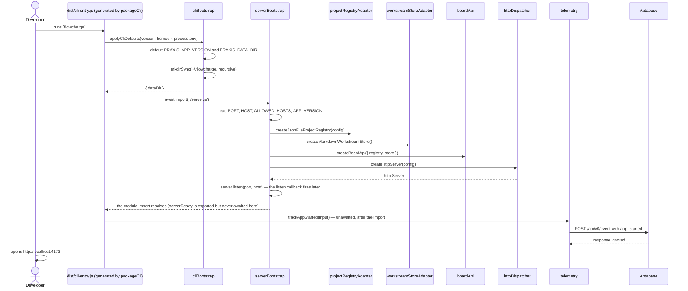
```mermaid
sequenceDiagram
    actor Developer
    participant cliEntry as dist/cli-entry.js (generated by packageCli)
    participant cliBootstrap
    participant serverBootstrap
    participant projectRegistryAdapter
    participant workstreamStoreAdapter
    participant boardApi
    participant httpDispatcher
    participant telemetry
    participant Aptabase

    Developer->>cliEntry: runs `flowcharge`
    cliEntry->>cliBootstrap: applyCliDefaults(version, homedir, process.env)
    cliBootstrap->>cliBootstrap: default PRAXIS_APP_VERSION and PRAXIS_DATA_DIR
    cliBootstrap->>cliBootstrap: mkdirSync(~/.flowcharge, recursive)
    cliBootstrap-->>cliEntry: { dataDir }
    cliEntry->>serverBootstrap: await import('./server.js')
    serverBootstrap->>serverBootstrap: read PORT, HOST, ALLOWED_HOSTS, APP_VERSION
    serverBootstrap->>projectRegistryAdapter: createJsonFileProjectRegistry(config)
    serverBootstrap->>workstreamStoreAdapter: createMarkdownWorkstreamStore()
    serverBootstrap->>boardApi: createBoardApi({ registry, store })
    serverBootstrap->>httpDispatcher: createHttpServer(config)
    httpDispatcher-->>serverBootstrap: http.Server
    serverBootstrap->>serverBootstrap: server.listen(port, host) — the listen callback fires later
    serverBootstrap-->>cliEntry: the module import resolves (serverReady is exported but never awaited here)
    cliEntry->>telemetry: trackAppStarted(input) — unawaited, after the import
    telemetry->>Aptabase: POST /api/v0/event with app_started
    Aptabase-->>telemetry: response ignored
    Developer->>Developer: opens http://localhost:4173
```

### 6.2 Register a project — happy path

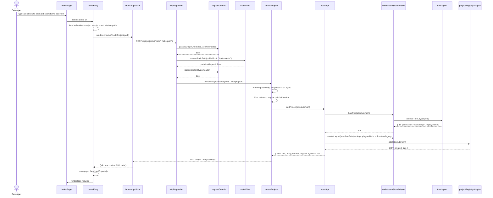
```mermaid
sequenceDiagram
    actor Developer
    participant indexPage
    participant homeEntry
    participant browserIpcShim
    participant httpDispatcher
    participant requestGuards
    participant staticFiles
    participant routesProjects
    participant boardApi
    participant workstreamStoreAdapter
    participant treeLayout
    participant projectRegistryAdapter

    Developer->>indexPage: types an absolute path and submits the add form
    indexPage->>homeEntry: submit event on #add-form
    homeEntry->>homeEntry: local validation — reject empty, ~ and relative paths
    homeEntry->>browserIpcShim: window.praxisAPI.addProject(path)
    browserIpcShim->>httpDispatcher: POST /api/projects {"path": "/abs/path"}
    httpDispatcher->>requestGuards: passesOriginCheck(req, allowedHosts)
    requestGuards-->>httpDispatcher: true
    httpDispatcher->>staticFiles: resolveStaticPath(publicRoot, "/api/projects")
    staticFiles-->>httpDispatcher: path inside publicRoot
    httpDispatcher->>requestGuards: isJsonContentType(header)
    requestGuards-->>httpDispatcher: true
    httpDispatcher->>routesProjects: handleProjectRoutes(POST /api/projects)
    routesProjects->>routesProjects: readRequestBody, capped at 8192 bytes
    routesProjects->>routesProjects: trim, refuse ~, require path.isAbsolute
    routesProjects->>boardApi: addProject(absolutePath)
    boardApi->>workstreamStoreAdapter: hasTree(absolutePath)
    workstreamStoreAdapter->>treeLayout: resolveTreeLayout(root)
    treeLayout-->>workstreamStoreAdapter: { dir, generation: "flowcharge", legacy: false }
    workstreamStoreAdapter-->>boardApi: true
    boardApi->>workstreamStoreAdapter: resolveLayout(absolutePath) — legacyLayoutDir is null unless legacy
    boardApi->>projectRegistryAdapter: add(absolutePath)
    projectRegistryAdapter-->>boardApi: { entry, created: true }
    boardApi-->>routesProjects: { kind: "ok", entry, created, legacyLayoutDir: null }
    routesProjects-->>browserIpcShim: 201 {"project": ProjectEntry}
    browserIpcShim-->>homeEntry: { ok: true, status: 201, data }
    homeEntry->>homeEntry: unwrapIpc, then loadProjects()
    homeEntry->>indexPage: renderTiles rebuilds #project-tiles
```

### 6.3 Open a board and poll for changes — happy path

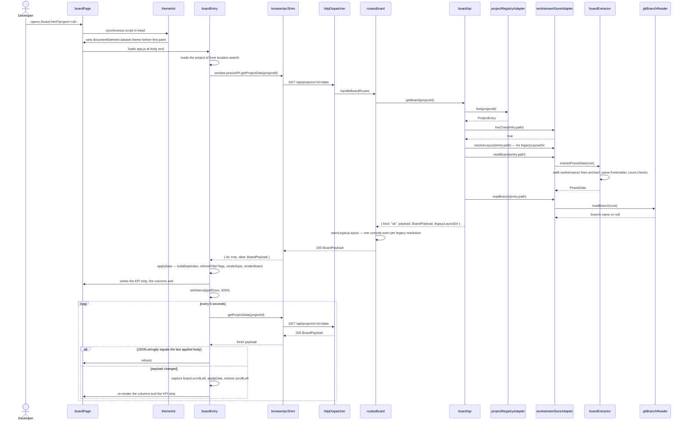
```mermaid
sequenceDiagram
    actor Developer
    participant boardPage
    participant themeInit
    participant boardEntry
    participant browserIpcShim
    participant httpDispatcher
    participant routesBoard
    participant boardApi
    participant projectRegistryAdapter
    participant workstreamStoreAdapter
    participant boardExtractor
    participant gitBranchReader

    Developer->>boardPage: opens /board.html?project=<id>
    boardPage->>themeInit: synchronous script in head
    themeInit->>boardPage: sets documentElement.dataset.theme before first paint
    boardPage->>boardEntry: loads app.js at body end
    boardEntry->>boardEntry: reads the project id from location.search
    boardEntry->>browserIpcShim: window.praxisAPI.getProjectData(projectId)
    browserIpcShim->>httpDispatcher: GET /api/projects/<id>/data
    httpDispatcher->>routesBoard: handleBoardRoutes
    routesBoard->>boardApi: getBoard(projectId)
    boardApi->>projectRegistryAdapter: find(projectId)
    projectRegistryAdapter-->>boardApi: ProjectEntry
    boardApi->>workstreamStoreAdapter: hasTree(entry.path)
    workstreamStoreAdapter-->>boardApi: true
    boardApi->>workstreamStoreAdapter: resolveLayout(entry.path) — for legacyLayoutDir
    boardApi->>workstreamStoreAdapter: readBoard(entry.path)
    workstreamStoreAdapter->>boardExtractor: extractPraxisData(root)
    boardExtractor->>boardExtractor: walk workstreams/ then archive/, parse frontmatter, count checks
    boardExtractor-->>workstreamStoreAdapter: PraxisData
    boardApi->>workstreamStoreAdapter: readBranch(entry.path)
    workstreamStoreAdapter->>gitBranchReader: readBranch(root)
    gitBranchReader-->>workstreamStoreAdapter: branch name or null
    boardApi-->>routesBoard: { kind: "ok", payload: BoardPayload, legacyLayoutDir }
    routesBoard->>routesBoard: warnLegacyLayout — one console.warn per legacy resolution
    routesBoard-->>browserIpcShim: 200 BoardPayload
    browserIpcShim-->>boardEntry: { ok: true, data: BoardPayload }
    boardEntry->>boardEntry: applyData — buildDepIndex, refreshFilterTags, renderKpis, renderBoard
    boardEntry->>boardPage: writes the KPI strip, the columns and #live-status
    boardEntry->>boardEntry: setInterval(pollOnce, 5000)

    loop every 5 seconds
        boardEntry->>browserIpcShim: getProjectData(projectId)
        browserIpcShim->>httpDispatcher: GET /api/projects/<id>/data
        httpDispatcher-->>browserIpcShim: 200 BoardPayload
        browserIpcShim-->>boardEntry: fresh payload
        alt JSON.stringify equals the last applied body
            boardEntry->>boardPage: refresh #live-status timestamp only, no re-render
        else payload changed
            boardEntry->>boardEntry: capture board.scrollLeft, applyData, restore scrollLeft
            boardEntry->>boardPage: re-render the columns and the KPI strip
        end
    end
```

### 6.4 Open a workstream detail modal — happy path

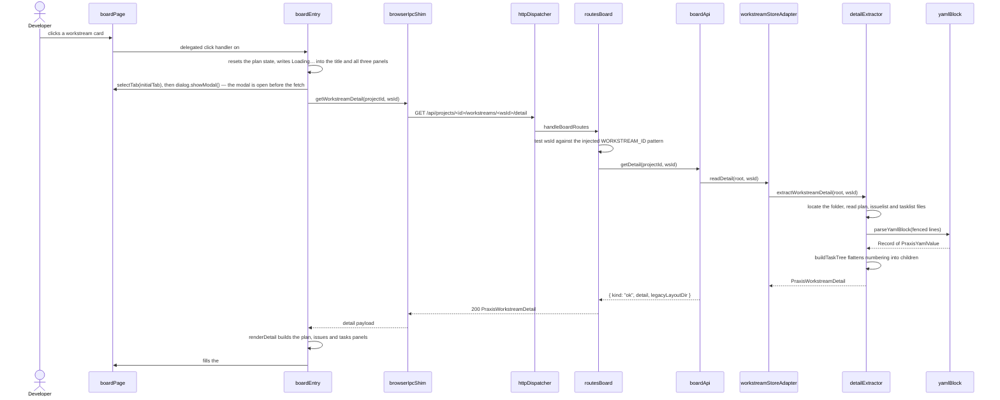
```mermaid
sequenceDiagram
    actor Developer
    participant boardPage
    participant boardEntry
    participant browserIpcShim
    participant httpDispatcher
    participant routesBoard
    participant boardApi
    participant workstreamStoreAdapter
    participant detailExtractor
    participant yamlBlock

    Developer->>boardPage: clicks a workstream card
    boardPage->>boardEntry: delegated click handler on #board calls openModal(wsId, initialTab)
    boardEntry->>boardEntry: resets the plan state, writes Loading… into the title and all three panels
    boardEntry->>boardPage: selectTab(initialTab), then dialog.showModal() — the modal is open before the fetch
    boardEntry->>browserIpcShim: getWorkstreamDetail(projectId, wsId)
    browserIpcShim->>httpDispatcher: GET /api/projects/<id>/workstreams/<wsId>/detail
    httpDispatcher->>routesBoard: handleBoardRoutes
    routesBoard->>routesBoard: test wsId against the injected WORKSTREAM_ID pattern
    routesBoard->>boardApi: getDetail(projectId, wsId)
    boardApi->>workstreamStoreAdapter: readDetail(root, wsId)
    workstreamStoreAdapter->>detailExtractor: extractWorkstreamDetail(root, wsId)
    detailExtractor->>detailExtractor: locate the folder, read plan, issuelist and tasklist files
    detailExtractor->>yamlBlock: parseYamlBlock(fenced lines)
    yamlBlock-->>detailExtractor: Record of PraxisYamlValue
    detailExtractor->>detailExtractor: buildTaskTree flattens numbering into children
    detailExtractor-->>workstreamStoreAdapter: PraxisWorkstreamDetail
    boardApi-->>routesBoard: { kind: "ok", detail, legacyLayoutDir }
    routesBoard-->>browserIpcShim: 200 PraxisWorkstreamDetail
    browserIpcShim-->>boardEntry: detail payload
    boardEntry->>boardEntry: renderDetail builds the plan, issues and tasks panels
    boardEntry->>boardPage: fills the #ws-modal header and panels in place
```

### 6.5 Install FlowCharge Core into a detected tool — happy path

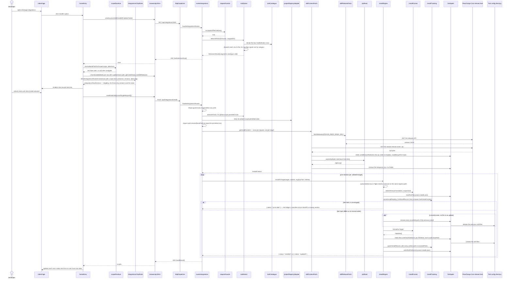
```mermaid
sequenceDiagram
    actor Developer
    participant indexPage
    participant homeEntry
    participant scopeResolver
    participant integrationsChipRules
    participant browserIpcShim
    participant httpDispatcher
    participant routesIntegrations
    participant requestGuards
    participant toolDetect
    participant toolCatalogue
    participant projectRegistryAdapter
    participant skillContentFetch
    participant skillReleaseFetch
    participant zipRead
    participant installEngine
    participant installFormat
    participant installTracking
    participant fsAdapter
    participant Gitea as FlowCharge Core release host
    participant ToolDir as Tool config directory

    Developer->>indexPage: opens Manage integrations
    indexPage->>homeEntry: click handler opens #integrations-modal
    homeEntry->>browserIpcShim: window.praxisSkillInstallAPI.detectTools()
    browserIpcShim->>httpDispatcher: GET /api/integrations/tools
    httpDispatcher->>routesIntegrations: handleIntegrationsRoutes
    routesIntegrations->>requestGuards: isLoopbackRemote(req)
    requestGuards-->>routesIntegrations: true
    routesIntegrations->>toolDetect: detectAllTools(fsAccess, mappedOs)
    toolDetect->>toolCatalogue: iterate the four ToolDefinition rows
    toolDetect->>toolDetect: dispatch each row to the cli or guiApp signal rule by category
    toolDetect-->>routesIntegrations: DetectionResult[] aligned to catalogue order
    routesIntegrations-->>browserIpcShim: 200 ToolDetectionRow[]
    browserIpcShim-->>homeEntry: rows
    homeEntry->>scopeResolver: resolveBasePathForScope(scope, detection)
    scopeResolver-->>homeEntry: the base path, or null when ineligible
    homeEntry->>browserIpcShim: checkInstalledSkills per row with a global base path, getInstallStatus, listSkillReleases
    homeEntry->>integrationsChipRules: deriveIntegrationsRowDecision(base path, scope kind, presence, versions, latest tag)
    integrationsChipRules-->>homeEntry: IntegrationsRowDecision — eligibility, the three chip answers and the notes
    homeEntry->>indexPage: renders one row per tool into #integrations-list, supplying the words for that decision
    Developer->>indexPage: selects tools and clicks Install selected
    homeEntry->>browserIpcShim: installSelected(InstallTargetRequest[])
    browserIpcShim->>httpDispatcher: POST /api/integrations/installs
    httpDispatcher->>routesIntegrations: handleIntegrationsRoutes
    routesIntegrations->>routesIntegrations: shape-guard every target before any write
    routesIntegrations->>toolDetect: detectAllTools, for global-scope permitted roots
    routesIntegrations->>projectRegistryAdapter: list(), for project-scope permitted roots
    routesIntegrations->>routesIntegrations: require path.resolve(basePath) to equal the permitted root
    routesIntegrations->>skillContentFetch: getInstallContent — once per request, not per target
    skillContentFetch->>skillReleaseFetch: fetchReleases(PRAXIS_REPO_BASE_URL)
    skillReleaseFetch->>Gitea: GET the releases API
    Gitea-->>skillReleaseFetch: release JSON
    skillContentFetch->>Gitea: GET the newest release asset .zip
    Gitea-->>skillContentFetch: zip bytes
    skillContentFetch->>fsAdapter: mkdir, writeBinaryFileAtomic the zip under os.tmpdir(), readBinaryFile it back
    skillContentFetch->>zipRead: parseZip(bytes read back from disk)
    zipRead-->>skillContentFetch: ZipEntry[]
    skillContentFetch->>fsAdapter: remove the temporary zip, in a finally
    skillContentFetch-->>routesIntegrations: InstallContent
    loop one iteration per validated target
        routesIntegrations->>installEngine: installToTarget(target, content, registryPath, fsWrite)
        installEngine->>installEngine: queue behind any in-flight install or removal on the same registry path
        installEngine->>installFormat: selectPrimaryFormat(tool, scope.kind)
        installEngine->>fsAdapter: readTextFile(.praxis-installs.json)
        installEngine->>installTracking: parseInstallRegistry, findInstallRecord, then compare hashInstallContent
        alt the hash is unchanged
            installEngine-->>routesIntegrations: { status: "up-to-date" } — the ledger is rewritten only to backfill a missing version
        else the hash differs or no record exists
            opt a record exists, so this is an update
                installEngine->>fsAdapter: remove every recorded path of the previous install
                fsAdapter->>ToolDir: deletes the previous skill files
            end
            installEngine->>installFormat: formatForTarget
            installFormat-->>installEngine: FileWrite[]
            installEngine->>fsAdapter: mkdir then writeTextFileAtomic per FileWrite, each inside basePath
            fsAdapter->>ToolDir: creates the skill files
            installEngine->>installTracking: upsertInstallRecord, with every written path in resolvedPaths
            installEngine->>fsAdapter: writeTextFileAtomic(.praxis-installs.json)
            installEngine-->>routesIntegrations: { status: "installed" } or { status: "updated" }
        end
    end
    routesIntegrations-->>browserIpcShim: 200 InstallResult[]
    browserIpcShim-->>homeEntry: results
    homeEntry->>indexPage: updates each row's status text from its own local row state
```

### 6.6 Alternative flow — a registered path loses its workstream tree

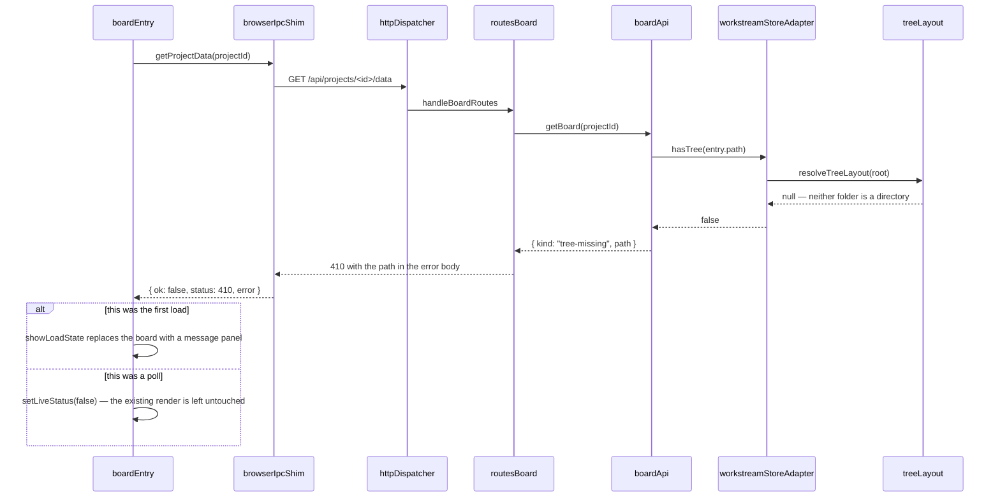
```mermaid
sequenceDiagram
    participant boardEntry
    participant browserIpcShim
    participant httpDispatcher
    participant routesBoard
    participant boardApi
    participant workstreamStoreAdapter
    participant treeLayout

    boardEntry->>browserIpcShim: getProjectData(projectId)
    browserIpcShim->>httpDispatcher: GET /api/projects/<id>/data
    httpDispatcher->>routesBoard: handleBoardRoutes
    routesBoard->>boardApi: getBoard(projectId)
    boardApi->>workstreamStoreAdapter: hasTree(entry.path)
    workstreamStoreAdapter->>treeLayout: resolveTreeLayout(root)
    treeLayout-->>workstreamStoreAdapter: null — neither folder is a directory
    workstreamStoreAdapter-->>boardApi: false
    boardApi-->>routesBoard: { kind: "tree-missing", path }
    routesBoard-->>browserIpcShim: 410 with the path in the error body
    browserIpcShim-->>boardEntry: { ok: false, status: 410, error }
    alt this was the first load
        boardEntry->>boardEntry: showLoadState replaces the board with a message panel
    else this was a poll
        boardEntry->>boardEntry: setLiveStatus(false) — the existing render is left untouched
    end
```

### 6.7 Alternative flow — an install path outside the permitted root

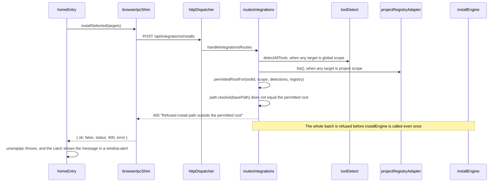
```mermaid
sequenceDiagram
    participant homeEntry
    participant browserIpcShim
    participant httpDispatcher
    participant routesIntegrations
    participant toolDetect
    participant projectRegistryAdapter
    participant installEngine

    homeEntry->>browserIpcShim: installSelected(targets)
    browserIpcShim->>httpDispatcher: POST /api/integrations/installs
    httpDispatcher->>routesIntegrations: handleIntegrationsRoutes
    routesIntegrations->>toolDetect: detectAllTools, when any target is global scope
    routesIntegrations->>projectRegistryAdapter: list(), when any target is project scope
    routesIntegrations->>routesIntegrations: permittedRootFor(toolId, scope, detections, registry)
    routesIntegrations->>routesIntegrations: path.resolve(basePath) does not equal the permitted root
    routesIntegrations-->>browserIpcShim: 400 "Refused install path outside the permitted root"
    Note over routesIntegrations,installEngine: The whole batch is refused before installEngine is called even once
    browserIpcShim-->>homeEntry: { ok: false, status: 400, error }
    homeEntry->>homeEntry: unwrapIpc throws, and the catch shows the message in a window.alert
```

### 6.8 Alternative flow — a non-local peer reaches the integrations routes

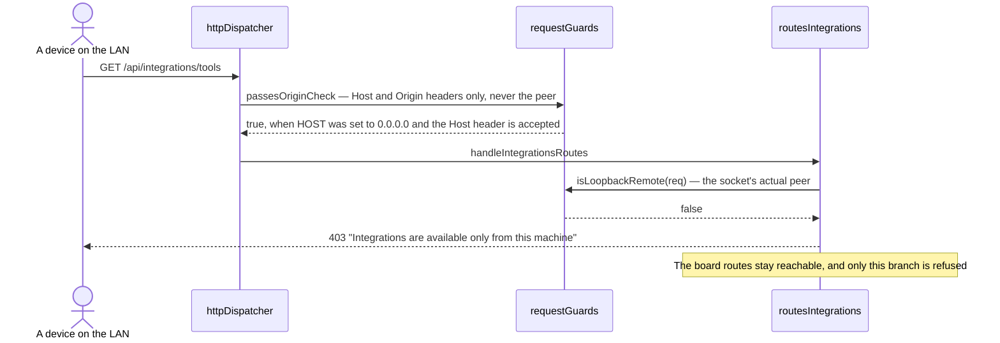
```mermaid
sequenceDiagram
    actor RemoteClient as A device on the LAN
    participant httpDispatcher
    participant requestGuards
    participant routesIntegrations

    RemoteClient->>httpDispatcher: GET /api/integrations/tools
    httpDispatcher->>requestGuards: passesOriginCheck — Host and Origin headers only, never the peer
    requestGuards-->>httpDispatcher: true, when HOST was set to 0.0.0.0 and the Host header is accepted
    httpDispatcher->>routesIntegrations: handleIntegrationsRoutes
    routesIntegrations->>requestGuards: isLoopbackRemote(req) — the socket's actual peer
    requestGuards-->>routesIntegrations: false
    routesIntegrations-->>RemoteClient: 403 "Integrations are available only from this machine"
    Note over routesIntegrations: The board routes stay reachable, and only this branch is refused
```

## 7. State Model

Eight independent state machines exist in the system. Each gets its own diagram.

### 7.1 Workstream status — the domain lifecycle FlowCharge renders

This machine lives in the markdown frontmatter of the project being viewed, not in
FlowCharge's own code. `boardExtractor` reads its current state; the coding agent writes
every transition, following the FlowCharge Core conventions. The five values are the
uniform status enum `backlog | ready | in-progress | done | dropped`. `archived` is an
orthogonal flag, not a status: it is set by moving the whole folder from `workstreams/`
to `archive/`, which the conventions allow only for a `done` or `dropped` record.
`boardEntry` files a card whose status is outside the enum into the backlog column.

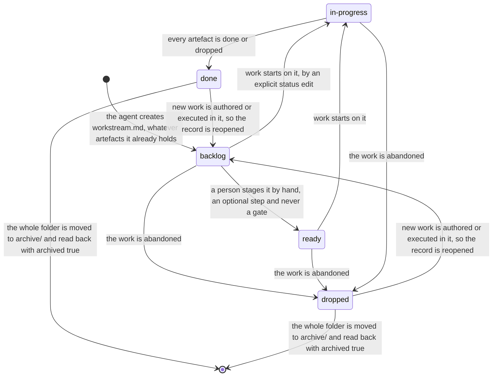
```mermaid
stateDiagram-v2
    state "in-progress" as in_progress

    [*] --> backlog: the agent creates workstream.md, whatever artefacts it already holds
    backlog --> ready: a person stages it by hand, an optional step and never a gate
    backlog --> in_progress: work starts on it, by an explicit status edit
    ready --> in_progress: work starts on it
    backlog --> dropped: the work is abandoned
    ready --> dropped: the work is abandoned
    in_progress --> done: every artefact is done or dropped
    in_progress --> dropped: the work is abandoned
    done --> backlog: new work is authored or executed in it, so the record is reopened
    dropped --> backlog: new work is authored or executed in it, so the record is reopened
    done --> [*]: the whole folder is moved to archive/ and read back with archived true
    dropped --> [*]: the whole folder is moved to archive/ and read back with archived true
```

### 7.2 Board page — load and poll

Owned by `boardEntry`. `lastBody` is the raw JSON of the last applied payload, and the
comparison against it is what decides between a repaint and a timestamp-only update.

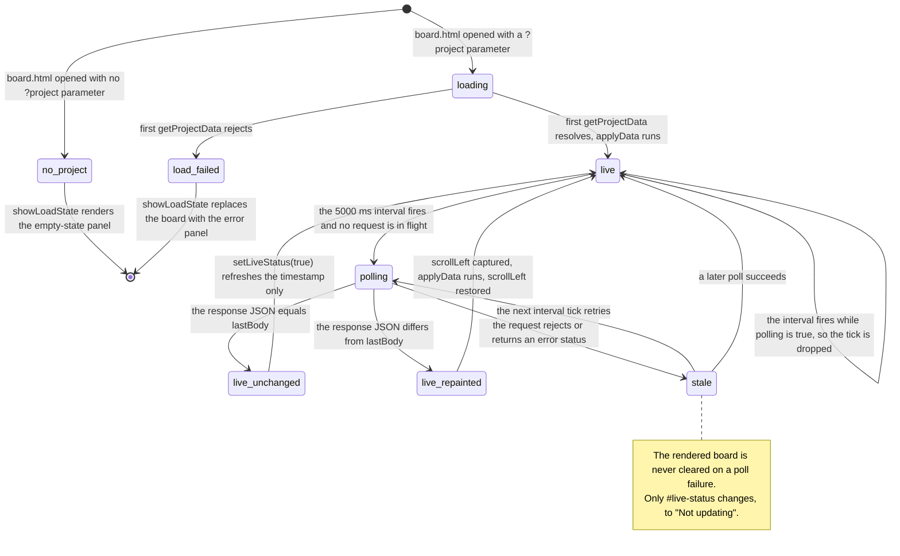
```mermaid
stateDiagram-v2
    [*] --> no_project: board.html opened with no ?project parameter
    [*] --> loading: board.html opened with a ?project parameter
    no_project --> [*]: showLoadState renders the empty-state panel

    loading --> live: first getProjectData resolves, applyData runs
    loading --> load_failed: first getProjectData rejects
    load_failed --> [*]: showLoadState replaces the board with the error panel

    live --> polling: the 5000 ms interval fires and no request is in flight
    live --> live: the interval fires while polling is true, so the tick is dropped
    polling --> live_unchanged: the response JSON equals lastBody
    polling --> live_repainted: the response JSON differs from lastBody
    polling --> stale: the request rejects or returns an error status
    live_unchanged --> live: setLiveStatus(true) refreshes the timestamp only
    live_repainted --> live: scrollLeft captured, applyData runs, scrollLeft restored
    stale --> polling: the next interval tick retries
    stale --> live: a later poll succeeds

    note right of stale
        The rendered board is never cleared on a poll failure.
        Only #live-status changes, to "Not updating".
    end note
```

### 7.3 Workstream detail modal

Owned by `boardEntry` as local state. `#ws-modal` is a native `<dialog>`: `openModal`
calls `showModal()` before the detail request is sent, so the modal is visible with
`Loading…` in its title and all three panels while the fetch is in flight, and the
dialog itself supplies Escape-to-close, the backdrop and focus containment.

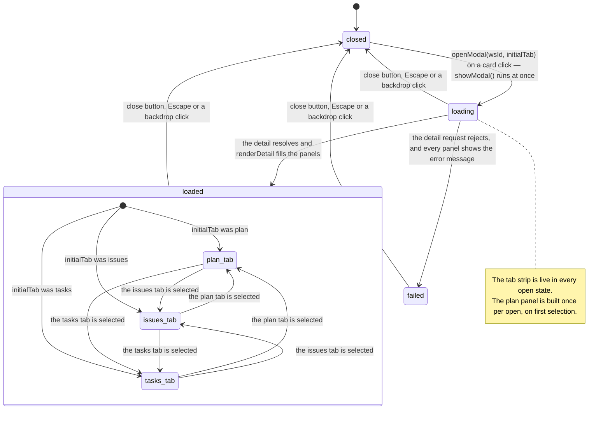
```mermaid
stateDiagram-v2
    [*] --> closed
    closed --> loading: openModal(wsId, initialTab) on a card click — showModal() runs at once
    loading --> loaded: the detail resolves and renderDetail fills the panels
    loading --> failed: the detail request rejects, and every panel shows the error message
    loaded --> closed: close button, Escape or a backdrop click
    failed --> closed: close button, Escape or a backdrop click
    loading --> closed: close button, Escape or a backdrop click

    state loaded {
        [*] --> plan_tab: initialTab was plan
        [*] --> issues_tab: initialTab was issues
        [*] --> tasks_tab: initialTab was tasks
        plan_tab --> issues_tab: the issues tab is selected
        plan_tab --> tasks_tab: the tasks tab is selected
        issues_tab --> plan_tab: the plan tab is selected
        issues_tab --> tasks_tab: the tasks tab is selected
        tasks_tab --> plan_tab: the plan tab is selected
        tasks_tab --> issues_tab: the issues tab is selected
    }

    note right of loading
        The tab strip is live in every open state.
        The plan panel is built once per open, on first selection.
    end note
```

### 7.4 Integrations row — one per catalogued tool

Owned by `homeEntry`, which paints each row but decides nothing: `integrationsChipRules`
answers every transition condition below from the base path `scopeResolver` resolves.
Detection runs once per modal open and once per Re-scan; eligibility is recomputed from
the current scope on every scope change, so the same tool can be selectable under one
scope and refused under another. The page has no
remove control: `removeInstallation` exists on the API surface and the HTTP route, but
`homeEntry` never calls it. Install and Update share one path, `installIntegrationsSelected`.

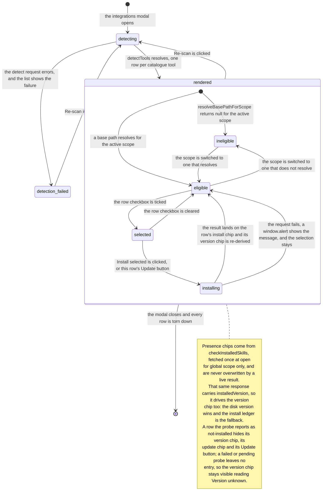
```mermaid
stateDiagram-v2
    [*] --> detecting: the integrations modal opens
    detecting --> detection_failed: the detect request errors, and the list shows the failure
    detecting --> rendered: detectTools resolves, one row per catalogue tool
    detection_failed --> detecting: Re-scan is clicked

    state rendered {
        [*] --> ineligible: resolveBasePathForScope returns null for the active scope
        [*] --> eligible: a base path resolves for the active scope
        ineligible --> eligible: the scope is switched to one that resolves
        eligible --> ineligible: the scope is switched to one that does not resolve
        eligible --> selected: the row checkbox is ticked
        selected --> eligible: the row checkbox is cleared
        selected --> installing: Install selected is clicked, or this row's Update button
        installing --> eligible: the result lands on the row's install chip and its version chip is re-derived
        installing --> eligible: the request fails, a window.alert shows the message, and the selection stays
    }

    rendered --> detecting: Re-scan is clicked
    rendered --> [*]: the modal closes and every row is torn down

    note right of rendered
        Presence chips come from checkInstalledSkills, fetched once at open
        for global scope only, and are never overwritten by a live result.
        That same response carries installedVersion, so it drives the version
        chip too: the disk version wins and the install ledger is the fallback.
        A row the probe reports as not-installed hides its version chip, its
        update chip and its Update button; a failed or pending probe leaves no
        entry, so the version chip stays visible reading Version unknown.
    end note
```

### 7.5 Install record — one per tool and scope pair in the ledger

Owned by `installEngine` over the `.praxis-installs.json` records `installTracking` parses.
`installToTarget` and `removeInstallation` share one queue per registry path, so no two
transitions on the same ledger overlap.

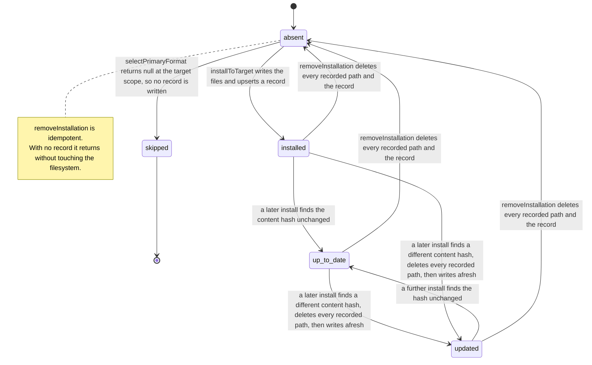
```mermaid
stateDiagram-v2
    [*] --> absent
    absent --> installed: installToTarget writes the files and upserts a record
    absent --> skipped: selectPrimaryFormat returns null at the target scope, so no record is written
    skipped --> [*]
    installed --> up_to_date: a later install finds the content hash unchanged
    up_to_date --> updated: a later install finds a different content hash, deletes every recorded path, then writes afresh
    installed --> updated: a later install finds a different content hash, deletes every recorded path, then writes afresh
    updated --> up_to_date: a further install finds the hash unchanged
    installed --> absent: removeInstallation deletes every recorded path and the record
    updated --> absent: removeInstallation deletes every recorded path and the record
    up_to_date --> absent: removeInstallation deletes every recorded path and the record

    note right of absent
        removeInstallation is idempotent.
        With no record it returns without touching the filesystem.
    end note
```

### 7.6 Theme mode

Owned by `themeStore`, persisted in `localStorage` under `praxis-theme`. `dark` is the
default when nothing is stored. `themeInit` reads this machine's state before first paint.

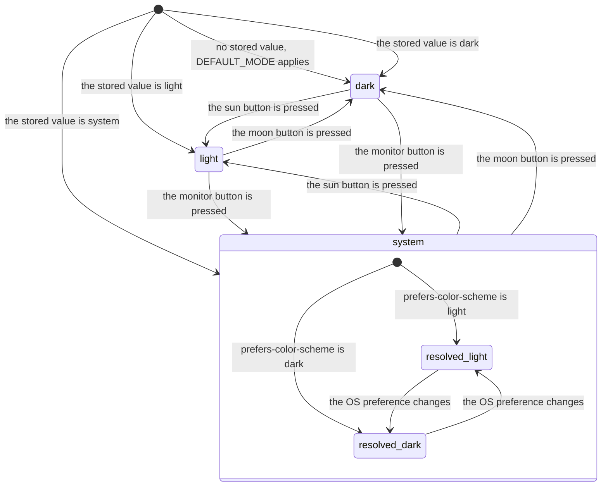
```mermaid
stateDiagram-v2
    [*] --> dark: no stored value, DEFAULT_MODE applies
    [*] --> system: the stored value is system
    [*] --> light: the stored value is light
    [*] --> dark: the stored value is dark

    system --> light: the sun button is pressed
    system --> dark: the moon button is pressed
    light --> system: the monitor button is pressed
    light --> dark: the moon button is pressed
    dark --> system: the monitor button is pressed
    dark --> light: the sun button is pressed

    state system {
        [*] --> resolved_light: prefers-color-scheme is light
        [*] --> resolved_dark: prefers-color-scheme is dark
        resolved_light --> resolved_dark: the OS preference changes
        resolved_dark --> resolved_light: the OS preference changes
    }
```

### 7.7 Update notice

The policy — enabled, due, newer, not already dismissed — lives entirely in
`electronUpdateIpc`; `updateBanner` only shows what it is handed. In the shipped CLI
binary there is no Electron bridge, so this machine never leaves `no_bridge`.

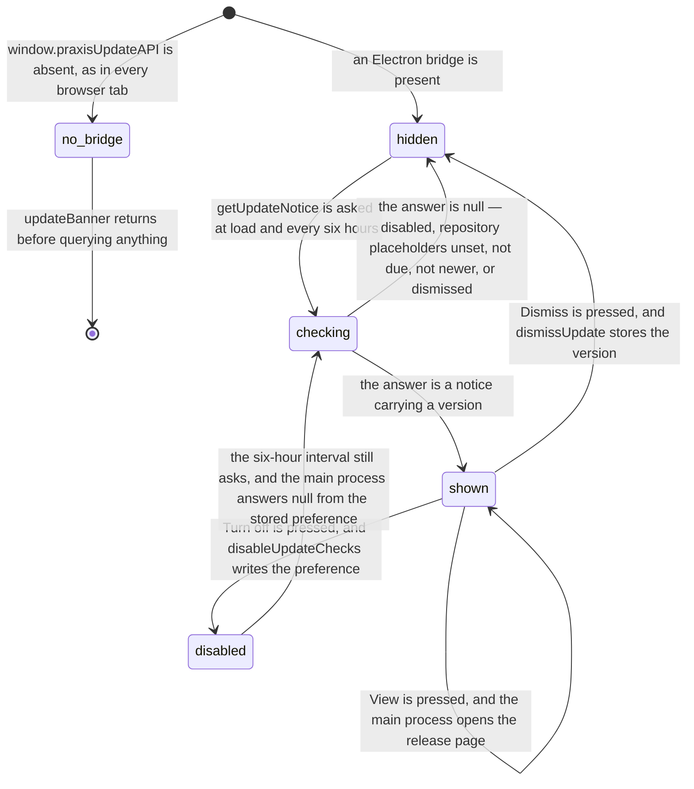
```mermaid
stateDiagram-v2
    [*] --> no_bridge: window.praxisUpdateAPI is absent, as in every browser tab
    no_bridge --> [*]: updateBanner returns before querying anything

    [*] --> hidden: an Electron bridge is present
    hidden --> checking: getUpdateNotice is asked at load and every six hours
    checking --> hidden: the answer is null — disabled, repository placeholders unset, not due, not newer, or dismissed
    checking --> shown: the answer is a notice carrying a version
    shown --> hidden: Dismiss is pressed, and dismissUpdate stores the version
    shown --> disabled: Turn off is pressed, and disableUpdateChecks writes the preference
    shown --> shown: View is pressed, and the main process opens the release page
    disabled --> checking: the six-hour interval still asks, and the main process answers null from the stored preference
```

### 7.8 HTTP server lifecycle

Owned by `serverBootstrap`. The `serverReady` promise carries readiness and the bound port
as one fact, which is what `electronMain` and the boundary test harness await.

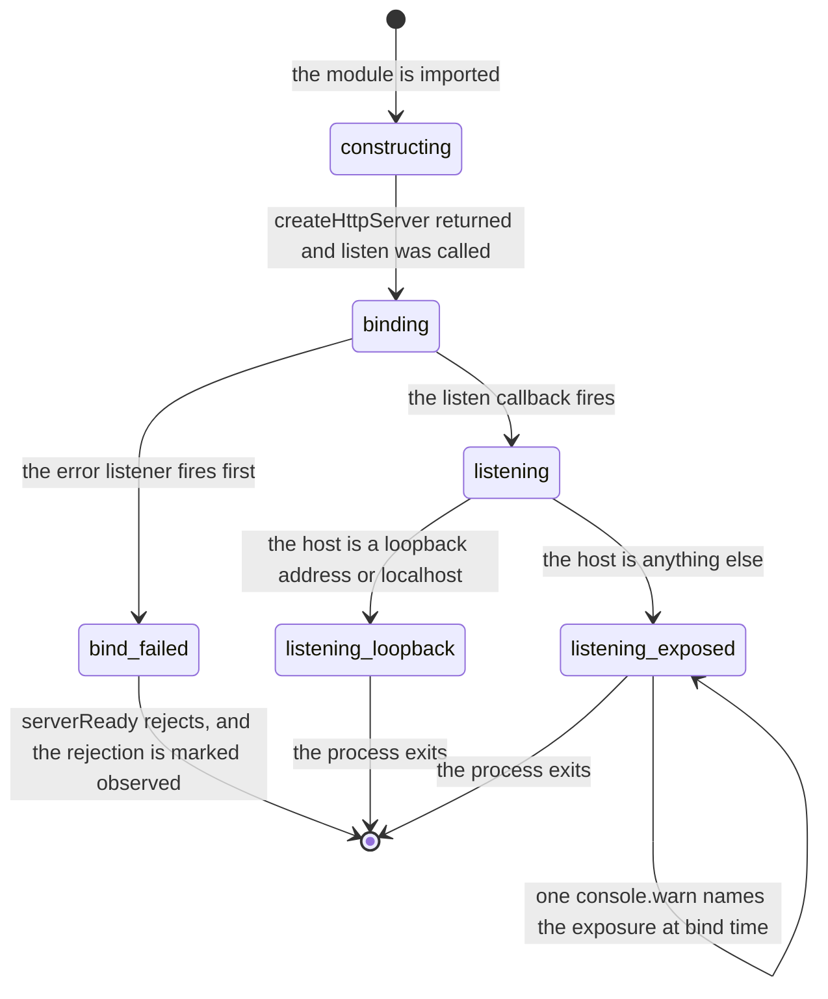
```mermaid
stateDiagram-v2
    [*] --> constructing: the module is imported
    constructing --> binding: createHttpServer returned and listen was called
    binding --> listening: the listen callback fires
    binding --> bind_failed: the error listener fires first
    listening --> listening_loopback: the host is a loopback address or localhost
    listening --> listening_exposed: the host is anything else
    listening_exposed --> listening_exposed: one console.warn names the exposure at bind time
    bind_failed --> [*]: serverReady rejects, and the rejection is marked observed
    listening_loopback --> [*]: the process exits
    listening_exposed --> [*]: the process exits
```

## 8. Integration Map

Every cross-component connection in the system. Each `From` and `To` names either a
component defined in Section 3 or one of the external systems drawn in Section 2, and every
application-defined type in the Data/Contract column is defined in Section 5. Where a cell
names no type, the payload is a primitive or a plain filesystem path.

| From | To | Mechanism | Data/Contract | Notes |
| --- | --- | --- | --- | --- |
| indexPage | themeInit | script src in head | none | Synchronous, so `data-theme` is set before first paint. |
| indexPage | homeEntry | script src at body end | none | `home.js` is the page's only other script. |
| indexPage | stylesheet | link rel stylesheet | none | One stylesheet, same origin, per the CSP. |
| boardPage | themeInit | script src in head | none | Same pre-paint contract as indexPage. |
| boardPage | boardEntry | script src at body end | none | `app.js` is the page's only other script. |
| boardPage | stylesheet | link rel stylesheet | none | Shared with indexPage. |
| homeEntry | browserIpcShim | side-effect import, first | none | Order is load-bearing: the shim installs the globals before any other module body runs. |
| boardEntry | browserIpcShim | side-effect import, first | none | Same ordering constraint. |
| homeEntry | appVersionFooter | side-effect import | none | No binding; reaches the page inside the `home.js` bundle. |
| boardEntry | appVersionFooter | side-effect import | none | No binding; reaches the page inside the `app.js` bundle. |
| homeEntry | updateBanner | side-effect import | none | Returns immediately without an Electron bridge. |
| boardEntry | updateBanner | side-effect import | none | Same. |
| homeEntry | themeToggle | side-effect import | none | Wires the `.seg` control both pages ship. |
| boardEntry | themeToggle | side-effect import | none | Same. |
| homeEntry | ipcAdapter | named import | `PraxisIpcResult` | `unwrapIpc` turns a failed result into a throw carrying the status. |
| boardEntry | ipcAdapter | named import | `PraxisIpcResult` | Same. |
| homeEntry | scopeResolver | named import | `InstallScope`, `DetectionResultLike` | `resolveBasePathForScope` only. `isEligibleAtScope` is still exported by `scopeResolver` but has no caller in `homeEntry`: eligibility is now `integrationsChipRules`' answer, derived from the same resolved base path. |
| homeEntry | integrationsChipRules | named import | `IntegrationsRowRuleInput`, `IntegrationsRowDecision` | The only import path from a browser bundle into `src/lib/`, permitted by the narrowed rule in Section 11's `browser-entry-bundles`. `deriveIntegrationsRowDecision` is called once per row per repaint and owns every rule; `homeEntry` owns the DOM writes and every user-facing string. |
| homeEntry | skillInstallApiTypes | type-only import | `DetectionConfidence`, `ToolDetectionRow`, `InstallResult`, `InstallRecord`, `SkillReleaseSummary`, `SkillPresenceResponse`, `PraxisSkillInstallAPI` | Types only; the module performs no fetch and touches no DOM. The presence map is keyed by `SkillPresenceResponse`, so one fetched response drives the install chip, the version chip and the update chip together. |
| browserIpcShim | ipcAdapter | type-only import | `PraxisIpcResult` | No runtime dependency on ipcAdapter. |
| themeInit | themeStore | named import | `ThemeMode`, `ResolvedTheme` | Reads the stored mode and applies the resolution. |
| themeToggle | themeStore | named import | `ThemeMode`, `ResolvedTheme` | `readMode` and `setMode` hit `localStorage` on every call. |
| browserIpcShim | httpDispatcher | fetch over same-origin HTTP | `PraxisIpcResult`, `ProjectList`, `ProjectEntry`, `BoardPayload`, `PraxisWorkstreamDetail` | The shim rebuilds the result envelope from the status and body; it never rejects. `getAppVersion` reads `/api/version` and collapses a failure to null. |
| browserIpcShim | httpDispatcher | fetch over same-origin HTTP | `ToolDetectionRow`, `InstallTargetRequest`, `InstallResult`, `InstallRecord`, `SkillReleaseSummary`, `SkillPresenceResponse` | The `/api/integrations/*` half of the same shim. |
| serverBootstrap | httpDispatcher | direct import, called once | `HttpServerConfig` | The composition root never binds inside `createHttpServer`. |
| serverBootstrap | boardApi | direct import, called once | `BoardApi` | Built from the two driven adapters. |
| serverBootstrap | projectRegistryAdapter | direct import, called once | `ProjectRegistry`, `ProjectRegistryConfig` | `dataDir`, `repoRoot` and `packaged` come from `PRAXIS_DATA_DIR`. |
| serverBootstrap | workstreamStoreAdapter | direct import, called once | `WorkstreamStore` | The only door to the markdown tree. |
| serverBootstrap | fsAdapter | direct import, called once | `FsAccess`, `FsWriteAccess` | The write adapter is built once, not per request. |
| serverBootstrap | boardExtractor | direct import of one constant | none | `ID_SUFFIX` only; the workstream-id pattern is composed here and injected. |
| httpDispatcher | requestGuards | direct import | none | `passesOriginCheck` and `isJsonContentType`, in that pipeline position. |
| httpDispatcher | staticFiles | direct import | none | `resolveStaticPath` runs on every request, `/api/` included. |
| httpDispatcher | jsonTransport | direct import | none | `sendJson` for the Content-Type 403, the `/api/version` answer, the 404 and the 500 fallback. |
| httpDispatcher | routesProjects | direct import, boolean dispatch | `BoardApi` | Returns true when it handled the request. |
| httpDispatcher | routesBoard | direct import, boolean dispatch | `BoardApi` | Also receives the injected workstream-id pattern. |
| httpDispatcher | routesIntegrations | direct import, boolean dispatch | `IntegrationsDeps` | An unmatched path in the branch falls through to the outer 404. |
| routesProjects | boardApi | injected interface call | `BoardApi`, `ProjectEntry`, `AddProjectResult` | Every registry read and write goes through the port. |
| routesProjects | routesBoard | direct import | none | `warnLegacyLayout`, shared so the wording exists once. |
| routesProjects | jsonTransport | direct import | none | `sendJson` and the 8192-byte `readRequestBody`. |
| routesProjects | requestGuards | direct import of two constants | none | `MAX_NAME_LENGTH` and `CONTROL_CHARS` for the rename route. |
| routesBoard | boardApi | injected interface call | `BoardApi`, `BoardResult`, `DetailResult`, `BoardPayload`, `PraxisWorkstreamDetail` | Maps each result variant to its own status code. |
| routesBoard | jsonTransport | direct import | none | `sendJson` only; this module reads no body. |
| routesIntegrations | requestGuards | direct import | none | `isLoopbackRemote`, above every route match in the branch. |
| routesIntegrations | jsonTransport | direct import | none | `sendJson`, `readRequestBody` and `errorMessage`. |
| routesIntegrations | projectRegistryAdapter | injected port call | `ProjectRegistry`, `ProjectEntry` | `list()` is re-read per call, so a project registered mid-session is not refused. |
| routesIntegrations | toolDetect | direct import | `DetectionResult`, `OS`, `FsAccess` | Called at most once per request and never cached across requests. |
| routesIntegrations | toolCatalogue | direct import | `ToolDefinition`, `OS` | Index alignment with the detection array is load-bearing. |
| routesIntegrations | canonicalSkills | direct import | none | The canonical skill id list handed to the presence probe. |
| routesIntegrations | skillPresence | direct import | `SkillPresenceResult`, `ToolDefinition`, `FsAccess` | Deliberately has no permitted-root check; the loopback gate is what bounds it. |
| routesIntegrations | skillVersion | direct import | `ToolDefinition`, `FsAccess` | `readInstalledSkillVersion` answers a bare string or null, and runs after `checkSkillPresence` over the same one `FsAccess` instance and the `presentSkillIds` that probe returned. The route spreads the two together into the 200 body as `installedVersion`, which is null for a `shared-file` or `no-format` result, for an empty `presentSkillIds`, and for a present file with no readable version. That composed body is named only on the browser side, as `SkillPresenceResponse`. |
| routesIntegrations | installEngine | direct import | `InstallTarget`, `InstallContent`, `InstallResult`, `InstallRecord`, `FsWriteAccess`, `InstallScope` | Every target is validated before any target is installed. The remove route checks every path `recordedInstallPaths` returns, the same list `removeInstallation` deletes, and one path outside the permitted root refuses the whole request. That check answers 400 before `removeInstallation` is called, and the remove then queues behind any install or removal on the same registry path. |
| routesIntegrations | installTracking | direct import | `InstallRecord`, `InstallScope` | `parseInstallRegistry` and `findInstallRecord` for the read and remove routes. |
| routesIntegrations | skillContentFetch | direct import | `InstallContent`, `SkillReleaseSummary` | `getInstallContent` is resolved once per request, not once per target. |
| boardApi | projectRegistryAdapter | injected port call | `ProjectRegistry`, `ProjectEntry` | The core holds no filesystem knowledge of its own. |
| boardApi | workstreamStoreAdapter | injected port call | `WorkstreamStore`, `TreeLayout`, `PraxisData`, `PraxisWorkstreamDetail` | Key order in the composed `BoardPayload` is load-bearing. |
| workstreamStoreAdapter | treeLayout | direct import | `TreeLayout`, `LayoutGeneration` | `flowcharge/` is preferred; `prxwork/` is the legacy fallback. |
| workstreamStoreAdapter | boardExtractor | direct import | `PraxisData` | Throws when the root holds no tree, which the core maps to `tree-missing`. |
| workstreamStoreAdapter | detailExtractor | direct import | `PraxisWorkstreamDetail` | Returns null for an unknown workstream, a different failure shape on purpose. |
| workstreamStoreAdapter | gitBranchReader | direct import | none | Returns the branch name or null; every failure mode is null. |
| boardExtractor | treeLayout | direct import | `TreeLayout` | Also uses `isWorkstreamMarker` to skip both marker generations. |
| boardExtractor | sharedTypes | ambient global reference | `PraxisData`, `PraxisWorkstream`, `PraxisArtefact`, `PraxisIssue` | No import; the declarations are ambient across both compilations. |
| detailExtractor | treeLayout | direct import | `TreeLayout` | Same layout resolution as the board walk. |
| detailExtractor | boardExtractor | direct import | none | `parseFrontmatter`, `artefactIdNumber`, `ISSUE_ITEM` and `TASK_ITEM`, so one rule serves both surfaces. |
| detailExtractor | yamlBlock | direct import | `PraxisYamlValue` | Every leaf is a string, a string array or a nested map — never a number or a boolean. |
| detailExtractor | sharedTypes | ambient global reference | `PraxisWorkstreamDetail`, `PraxisPlanDetail`, `PraxisIssueListDetail`, `PraxisTaskListDetail`, `PraxisDetailArtefact`, `PraxisIssueDetail`, `PraxisTaskDetail` | Ambient, no import. |
| extractCli | boardExtractor | direct import | `PraxisData` | A thin argv wrapper; the board never reads its output file. |
| extractCli | treeLayout | direct import | `TreeLayout` | Resolves the layout first and prints the same `LEGACY LAYOUT` line as `routesBoard`, byte for byte, to `console.warn`. |
| toolDetect | toolCatalogue | direct import | `ToolDefinition`, `OS` | Iterates the catalogue and never branches on a tool id. |
| toolDetect | toolSignals | direct import | `DetectionResult`, `FsAccess`, `OS` | Dispatch by `ToolCategory` only. |
| toolSignals | toolCatalogue | direct import | `OsPath`, `SourceConfidence`, `ToolDefinition` | A `ToolDefinition` is a plain argument, never a switch target. |
| skillPresence | toolSignals | injected port call | `FsAccess` | Uses `pathExists` only, never anything from `FsWriteAccess`. |
| skillPresence | installFormat | direct import | `IntegrationFormat`, `FileWrite`, `InstallContent` | Derives each expected path through `selectPrimaryFormat` and `formatForTarget` over a stub `InstallContent`, never a hand-rolled path guess. |
| skillVersion | toolSignals | injected port call | `FsAccess` | Uses `readTextFile` only, never anything from `FsWriteAccess`. |
| skillVersion | installFormat | direct import | `IntegrationFormat`, `FileWrite`, `InstallContent` | Resolves each present skill's read path the same way `skillPresence` resolves its expected path, and answers the first version that parses. |
| skillVersion | yamlBlock | direct import | `PraxisYamlValue` | `parseFrontmatter` in `boardExtractor` reads flat keys only, so the nested-map grammar of `parseYamlBlock` is what reaches `metadata.version`. |
| installEngine | installFormat | direct import | `IntegrationFormat`, `FileWrite`, `InstallContent` | `selectPrimaryFormat` returns null for a tool with no usable format at the target's scope, so Cursor and Windsurf are skipped at global scope. |
| installEngine | installContent | direct import | `InstallContent`, `SkillContent` | `hashInstallContent` is what distinguishes up-to-date from updated. |
| installEngine | installTracking | direct import | `InstallRecord`, `InstallScope` | The engine owns reading and persisting the ledger file. |
| installEngine | fsAdapter | injected port call | `FsWriteAccess` | Never `node:fs` directly. |
| installFormat | toolCatalogue | direct import | `IntegrationFormat`, `FormatKind`, `ToolDefinition` | Knows format kinds, never tool ids. |
| skillContentFetch | skillReleaseFetch | direct import | `SkillReleaseSummary` | The base URL always crosses as a parameter, so there is no import cycle. |
| skillContentFetch | zipRead | direct import | `ZipEntry` | Parses the bytes read back from the temporary file, never the HTTP buffer. |
| skillContentFetch | fsAdapter | injected port call | `ArchiveFsAccess`, `FsWriteAccess` | Owns the downloaded zip's whole lifetime, including its removal. |
| telemetry | telemetryInstallId | direct import | `InstallIdResult` | Called only after the opt-out check passes. |
| cliBootstrap | portCliBootstrap | implements | `CliBootstrapInput`, `CliBootstrapResult` | `env` is mutated in place, which is what lets the generated entry call it as a statement. |
| electronMain | serverBootstrap | dynamic import, awaits the exported promise | none | A static import would hoist above the environment defaults. |
| electronMain | electronIpcHandlers | direct import | none | `registerIpcHandlers`, called after the port is known. |
| electronMain | electronToolsIpc | direct import | none | `registerAgenticToolsIpcHandlers`, awaited because it dynamic-imports `src/lib` first. |
| electronMain | electronUpdateIpc | direct import | none | `registerUpdateCheckIpcHandlers`, awaited for the same reason. |
| electronMain | electronThemeIpc | direct import | none | `registerThemeIpcHandlers`, synchronous because it imports nothing from `src/lib`. |
| electronIpcHandlers | electronMain | direct import | none | Reads `SERVER_URL`, the loopback base every relayed request targets. |
| electronIpcHandlers | httpDispatcher | loopback HTTP request | `PraxisIpcResult`, `ProjectList`, `ProjectEntry`, `BoardPayload`, `PraxisWorkstreamDetail` | No validation lives in the handler; every rule still runs inside the server. |
| electronToolsIpc | installEngine | in-process call via dynamic import | `InstallTarget`, `InstallResult`, `InstallContent`, `InstallScope` | Hand-mirrors routesIntegrations, with one gap: the remove channel still checks only `resolvedPath` against the permitted root, while `removeInstallation` deletes every recorded path. |
| electronToolsIpc | installTracking | in-process call via dynamic import | `InstallRecord`, `InstallScope` | `parseInstallRegistry` and `findInstallRecord`, for the status and remove channels. |
| electronToolsIpc | projectRegistryAdapter | in-process call via dynamic import | `ProjectEntry` | `readProjects`, the module-scope default instance, re-read per call for project-scope permitted roots. |
| electronToolsIpc | fsAdapter | in-process call via dynamic import | `FsWriteAccess`, `FsAccess` | Builds one write adapter at registration and one read adapter per detection sweep. |
| electronToolsIpc | toolCatalogue | in-process call via dynamic import | `ToolDefinition` | Index alignment with the detection array, exactly as in `routesIntegrations`. |
| electronToolsIpc | toolDetect | in-process call via dynamic import | `DetectionResult`, `OS` | `detectAllTools`, once per IPC call. |
| electronToolsIpc | skillPresence | in-process call via dynamic import | `SkillPresenceResult` | `checkSkillPresence` behind the `checkInstalledSkills` channel. The channel answers a bare `SkillPresenceResult`, so it carries no `installedVersion` and diverges from the HTTP route, which answers a `SkillPresenceResponse`. Per ADR-001 the Electron path is not shipped, so this divergence is recorded rather than closed. |
| electronToolsIpc | canonicalSkills | in-process call via dynamic import | none | `CANONICAL_PRAXIS_SKILL_IDS` for the presence probe. |
| electronToolsIpc | skillContentFetch | in-process call via dynamic import | `InstallContent`, `SkillReleaseSummary` | `getInstallContent` and `listSkillReleases`. |
| electronUpdateIpc | updateCheck | in-process call via dynamic import | `LatestRelease` | The renderer never makes the network call. |
| electronUpdateIpc | updatePrefs | in-process call via dynamic import | `UpdatePrefs` | Owns the whole enabled, due, newer and dismissed policy. |
| electronPreload | electronIpcHandlers | contextBridge then ipcRenderer.invoke | `PraxisAPI`, `PraxisIpcResult` | Eight channels, forwarded raw: the six data methods plus `pickProjectFolder` and `getAppVersion`, which answer a bare value rather than an envelope. |
| electronPreload | electronToolsIpc | contextBridge then ipcRenderer.invoke | `PraxisSkillInstallAPI`, `PraxisIpcResult` | Six channels. |
| electronPreload | electronUpdateIpc | contextBridge then ipcRenderer.invoke | none | Four zero-argument channels answering a notice object or null. |
| electronPreload | electronThemeIpc | contextBridge then ipcRenderer.invoke | `ThemeMode` | One channel, `setThemeSource`. |
| updateBanner | electronUpdateIpc | optional global, guarded | none | Absent in a browser tab, so the module returns before querying anything. |
| themeToggle | electronThemeIpc | optional global, guarded | `ThemeMode` | Optional-chained, and a rejection is swallowed. |
| copyAssets | stylesheet | file copy at build time | none | Copies `index.html`, `board.html`, `styles.css` and two images only; no font file is copied. |
| copyAssets | indexPage | file copy at build time | none | Same copy loop. |
| copyAssets | boardPage | file copy at build time | none | Also refuses the build if any `.map` file is found under `dist/`. |
| bundlePublic | homeEntry | esbuild entry point | none | Bundled to one IIFE, `dist/public/home.js`. |
| bundlePublic | boardEntry | esbuild entry point | none | Bundled to one IIFE, `dist/public/app.js`. |
| bundlePublic | themeInit | esbuild entry point | none | Its own output file, because it must run in `<head>`. |
| packageCli | cliBootstrap | generated static import, called as a statement | `CliBootstrapInput`, `CliBootstrapResult` | Runs before the server module is imported. |
| packageCli | serverBootstrap | generated dynamic import | none | Must stay dynamic: the server reads its environment at module scope. |
| packageCli | telemetry | generated static import, called last | `TelemetryInput` | Unawaited, and after the socket bind, so it never delays startup. |
| releaseCmd | packageCli | child process running the npm script | none | Confirms the expected artefacts landed before tagging. |
| releaseCmd | releaseFormat | direct import | none | `isBareVersion` and `newestVersion`. |
| publishRelease | releaseFormat | direct import | none | `sectionBody` supplies the release notes. |
| bumpFormula | releaseFormat | direct import | none | `isBareVersion` guards the version it writes into the formula. |
| publishRelease | GitHub Releases API | `gh release create` in a child process | none | The one outward-facing release call, run by the maintainer; the running application never makes it. |
| telemetry | Aptabase | outbound POST with a 3000 ms abort timeout | `AptabaseEvent` | No cookie and no credential, and the response body is ignored entirely. Only the generated CLI entry calls this, so `npm start` and `npm test` send nothing. |
| updateCheck | GitHub Releases API | outbound GET with a 10000 ms abort timeout | `LatestRelease` | The owner and repository constants are unset placeholders today, so no request is made. |
| skillReleaseFetch | FlowCharge Core release host | outbound GET with a 10000 ms abort timeout, body capped at 4 MB | `SkillReleaseSummary` | The base URL arrives as a parameter, never as a constant in this module. |
| skillContentFetch | FlowCharge Core release host | outbound GET for the asset with a 30000 ms abort timeout over the whole transfer, body capped at 64 MB | `ZipEntry`, `InstallContent` | A missing release or a release with no `.zip` asset is a named failure, never a silent substitution. It logs nothing: the error is rethrown untouched, and the calling route owns the failure report. |
| fsAdapter | Tool config directory | node:fs/promises writes and recursive removes | `FileWrite` | The only runtime component that writes into a tool's configuration directory; it also holds the temporary zip under `os.tmpdir()` for `skillContentFetch`. |
| projectRegistryAdapter | FlowCharge data directory | node:fs read and write of `.praxis-projects.json` | `ProjectEntry`, `ProjectRegistryConfig` | `PRAXIS_DATA_DIR` overrides the repository root. |
| updatePrefs | FlowCharge data directory | node:fs read and atomic write of `.praxis-update.json` | `UpdatePrefs` | Every read failure returns the defaults rather than throwing; a write failure throws to the caller. |
| telemetryInstallId | FlowCharge data directory | node:fs atomic write of `.praxis-telemetry.json` | `InstallIdResult` | Mirrors updatePrefs: no failure ever throws. |
| installEngine | FlowCharge data directory | node:fs write of `.praxis-installs.json` | `InstallRecord` | Written through the injected `FsWriteAccess`, never `node:fs` directly. |
| boardExtractor | Project working copy | node:fs directory walk and file reads | `PraxisData` | Reads `workstreams/` and then `archive/` on every request. |
| detailExtractor | Project working copy | node:fs directory listing and file reads | `PraxisWorkstreamDetail` | Sorts its listing explicitly, unlike the board walk. |
| gitBranchReader | Project working copy | node:fs read of `.git/HEAD` | none | A missing `.git`, a detached HEAD and a dangling `gitdir:` pointer all return null. |
| staticFiles | Browser UI | HTTP response with a Content-Security-Policy header | none | The CSP rides on the 200 path only, never on the 404. |

## 9. Approved Libraries

FlowCharge has **no runtime dependency**. Every entry below is a `devDependency` or a
`PATH` tool used at build or release time; the shipped code uses only Node and browser
built-ins. Adding a `dependencies` entry to `package.json` is a breaking architectural
change, not a routine one.

The Version column carries two facts read from this repository: the constraint
`package.json` declares, and the version `node_modules` currently resolves. They are the
versions this architecture is built against. This column is deliberately not a
latest-available survey — the system already exists, and what it is pinned to is the fact
an engineer needs.

| Package | Version | Purpose | Forbidden Alternatives |
| --- | --- | --- | --- |
| `typescript` | declared `^5.9.3`, resolved `5.9.3` | Compiles all three projects: the Node side, the browser side (type-check only, `noEmit`) and the Electron side. | Babel, SWC and any transpiler that does not type-check — `tsc --noEmit` is the browser side's only type gate. |
| `@types/node` | declared `^22.20.1`, resolved `22.20.1` | Node built-in types for the Node and Electron compilations. | Must never reach the browser compilation: `src/public/tsconfig.json` sets `"types": []` precisely to keep it out. |
| `esbuild` | declared `^0.25.12`, resolved `0.25.12` | Bundles `homeEntry`, `boardEntry` and `themeInit` into one IIFE each, in `bundlePublic`. | Webpack, Rollup, Vite, Parcel and any build framework — the project's stated position is no build framework and plain ESM tooling. |
| `javascript-obfuscator` | declared `^4.2.2`, resolved `4.2.2` | Obfuscates the browser bundles in `build:release` only. | `controlFlowFlattening`, `deadCodeInjection`, `selfDefending`, `debugProtection`, `renameGlobals`, `renameProperties`, `transformObjectKeys` and `domainLock` are all forbidden settings — each one breaks the contextBridge name contract, the JSON request bodies, or the CSP. |
| `electron` | declared `^43`, resolved `43.6.0` | Compiles and runs the `electronSide` scaffolding under `npm run electron:dev`. | Not a release path. Per ADR-001 the Electron desktop build is unmaintained scaffolding and is never shipped. |
| `electron-builder` | declared `^26`, resolved `26.15.3` | Backs the `package:mac`, `package:linux` and `package:win` scripts against the same `electronSide` scaffolding. | Same as above: these three scripts are not a release path, and their output is never published. |
| `bun` | a `PATH` tool, not a dependency; any version whose `bun --version` succeeds | `packageCli` runs `bun build --compile` to produce the single-file executables — the one real release artefact. | Not installable as a `devDependency` here; `packageCli` probes `PATH` and refuses with a named error when it is absent. |
| `gh` | a `PATH` tool, not a dependency; any authenticated version | `publishRelease` attaches the built binaries to a GitHub Release. | `releaseCmd` checks for it before it builds, so a tag is never cut with no way to publish it. |
| `node` | `>=20.14`, declared in `engines` | The runtime for the unpackaged server under `npm start`, for the test suite, and for every build and release script. The packaged binary embeds Bun's runtime instead. | No polyfill and no shim layer: `node:http`, `node:fs`, `node:zlib`, `fetch` and `AbortSignal.timeout` are all used as built-ins. |

**Forbidden runtime additions.** These are the substitutions the codebase has already
refused, each with the component that replaces it: an HTTP framework such as Express or
Fastify (`httpDispatcher` uses `node:http` directly), a YAML library (`yamlBlock` parses
the subset the app needs), a zip library such as `adm-zip` or `jszip` (`zipRead` is
hand-rolled over `node:zlib`), and any front-end framework (`homeEntry` and `boardEntry`
build DOM by hand).

**Flagged, unverified.** `updateCheck` ships `RELEASE_REPO_OWNER` and `RELEASE_REPO_NAME`
as the literal placeholders `TODO-REPLACE-OWNER` and `TODO-REPLACE-REPO`. Its
`isReleaseRepoConfigured` guard exists for exactly this state, so the update check is inert
until both are set. This is a real gap in the shipped configuration, not a documentation
omission.

## 10. Architecture Constraints

Every rule below is enforceable by a named mechanism that already exists in the repository.

### 10.1 Coding Standards

| Rule | Enforcement mechanism |
| --- | --- |
| All three compilations run in strict mode. | `"strict": true` in `tsconfig.json`, `src/public/tsconfig.json` and `electron/tsconfig.json`. |
| No emit survives a type error on the Node or Electron side. | `"noEmitOnError": true` in `tsconfig.json` and `electron/tsconfig.json`. |
| Browser code never sees Node types. | `"types": []` in `src/public/tsconfig.json` — load-bearing, because omitting it auto-includes `@types/node`. |
| Node code never sees DOM types. | `"lib": ["es2022"]` with no `"dom"` entry in `tsconfig.json`. |
| Browser modules must be transpilable file by file. | `"isolatedModules": true` in `src/public/tsconfig.json`, matching how esbuild transpiles. |
| The browser compilation type-checks but never emits. | `"noEmit": true` in `src/public/tsconfig.json`; `bundlePublic` owns emit. |
| Node-side imports use explicit `.js` specifiers. | `"module": "node16"` with `"moduleResolution": "node16"` in `tsconfig.json`. |
| `src/http/` must not import the extractor. | The workstream-id pattern is built in `serverBootstrap` and passed through `HttpServerConfig.workstreamIdPattern`; `src/test/boundary/server-board.test.ts` pins the `400 Malformed workstream id` behaviour the injected pattern produces. |
| `src/ports/` files carry no imports of any kind. | Enforced by review and stated in each port file's header; a port that imports stops being a type-only contract. |
| `src/core/` knows no transport, no status code and no user-facing string. | `boardApi` returns result variants; the status mapping is recorded in `src/ports/app-api.ts` and applied in `routesBoard` and `routesProjects`. |
| `src/core/` and the four markdown libraries log nothing. | The `LEGACY LAYOUT` warning is printed by `warnLegacyLayout` in `routesBoard` and, byte for byte, by `extractCli`. No `src/lib/` module logs either: `skillContentFetch` rethrows an install failure untouched, and the calling route owns the report. |
| Test files carrying no assertions must not carry `.test.` in the name. | `src/test/fixture-project.ts`, `src/test/expected-skill-ids.ts` and `src/test/boundary/server-harness.ts` follow this; a `.test.` name would double-register the importing file's cases. |

### 10.2 Quality Gates

| Metric | Threshold | Tool |
| --- | --- | --- |
| Type errors across all three projects | zero | `tsc -p tsconfig.json`, `tsc -p src/public/tsconfig.json`, `tsc -p electron/tsconfig.json`, chained by `npm run build:base`. |
| Test suite result | all pass | `node --test --test-force-exit "dist/**/*.test.js" ".github/scripts/**/*.test.mjs"`, run by `npm test` after `pretest` builds. |
| Source maps under `dist/` | zero | `tools/copy-assets.mjs` throws and names every `.map` file it finds. |
| `eval(`, `new Function(` or `Function(` in any browser bundle | zero | The `FORBIDDEN` substring scan in `tools/bundle-public.mjs`, run after obfuscation and before anything is written. |
| Stale per-file `.js` output under `dist/public/` | zero | `sweepJavaScript` in `tools/bundle-public.mjs` removes every `.js` file before bundling. |
| Release artefacts present before a tag is cut | exactly three non-empty `flowcharge-<version>-*` files — `darwin-arm64`, `darwin-x64`, `linux-x64` — the default `package:cli` set | `.github/scripts/release.mjs`, which refuses before it tags. |
| CHANGELOG heading matches `package.json` version | exact match on the newest `## X.Y.Z` | `.github/scripts/release-format.mjs` `newestVersion`, called by `release.mjs`. |
| CI on every push and pull request to `main` | `npm ci` then `npm test` must pass | `.github/workflows/ci.yml`. `npm ci` requires `package-lock.json`, which is not committed — only `bun.lock` is — so this gate cannot pass as the repository stands. |

### 10.3 Performance Budgets

| Metric | Budget |
| --- | --- |
| Board poll interval | 5000 ms (`POLL_MS` in `boardEntry`); a tick is dropped whenever a request is still in flight. |
| Board repaint on an unchanged payload | zero DOM writes beyond the `#live-status` timestamp — the raw JSON is compared against `lastBody` first. |
| Request body size | 8192 bytes (`MAX_BODY_BYTES` in `jsonTransport`); anything larger gets a 413 and the request is destroyed. |
| Outbound network call timeout | telemetry carries `AbortSignal.timeout(3000)`, the update check and `skillReleaseFetch` `AbortSignal.timeout(10000)`, and `skillContentFetch` `AbortSignal.timeout(30000)`, each the module's `DEFAULT_TIMEOUT_MS`. The two release-host signals stay armed while the body streams, so each budget covers the whole transfer, and the two fetches also cap the body at 4 MB and 64 MB. |
| Telemetry cost to startup | zero — `trackAppStarted` is the last statement of the generated entry, is unawaited, and runs after the `./server.js` import, by which time `listen` has been called. |
| Tool detection cost | at most one full catalogue sweep per `/api/integrations/*` request, and never cached across requests. |
| Skill content resolution | exactly one release fetch and one temporary zip per install request, whatever the batch size. |
| Plan body rendering | at most 12 blocks before the Show more control, and truncation only above 16 blocks (`PLAN_BLOCK_LIMIT` and `PLAN_TRUNCATE_THRESHOLD`). |
| Filter chip count | at most 10 chips, each needing at least 2 workstreams and under 30% board share (`TAG_MAX_CHIPS`, `TAG_MIN_COUNT`, `TAG_MAX_SHARE`). |

### 10.4 Error Handling Rules

| Scenario | Required behaviour |
| --- | --- |
| Any throw inside an `/api/` handler | Caught by `httpDispatcher`'s try/catch, logged with the method and path, and answered `500 {"error": "Internal server error"}`. An uncaught throw inside an `http.createServer` handler ends the process. |
| Any throw inside an async `/api/integrations/*` handler | Caught by that handler's own try/catch, because the dispatcher's try/catch returns before the promise settles. |
| A rejected `fetch` in the browser shim | `fetchIpc` resolves with `{ ok: false, status: 0, error }` and never rejects. |
| A failed board poll | `setLiveStatus(false)` only. The existing render must never be replaced — that behaviour is correct for a first load and wrong for a refresh. |
| A failed first board load | `showLoadState` replaces the board with a message panel. |
| A missing or unreadable `.git/HEAD` | `gitBranchReader` returns null. A detached HEAD and a dangling `gitdir:` pointer are normal states, so nothing is logged and nothing throws. |
| A missing project registry, update-preferences or telemetry file | Each library returns a usable default rather than throwing; the registry suppresses its self-entry when `packaged` is true. |
| An unreadable `package.json` at version-resolution time | `serverBootstrap` logs once, leaves `APP_VERSION` null, and `/api/version` then answers 500. |
| A socket bind failure | The `error` listener logs it and rejects `serverReady`; the rejection is explicitly marked observed so it is reported once, not twice. |
| An unsupported `os.platform()` | `mapNodePlatformToOs` returns null and the route answers 500, rather than calling detection with a fabricated OS. |
| A telemetry failure of any kind | Do nothing. The whole body sits inside one unconditional catch, because `AbortSignal.timeout` rejects with a `DOMException`, not an `Error`. |
| An update-check failure of any kind | Same unconditional catch, for the same `DOMException` reason. |
| A missing release, or a release with no `.zip` asset | A named failure the user sees. Never a quiet substitution and never a branch fallback. |
| `removeInstallation` with no matching record | A silent, idempotent no-op answered `200 null`, not a failure. |
| A request body over 8192 bytes | `413`, and `req.destroy()` so the client stops streaming. |

### 10.5 State Management Rules

| Rule | Detail |
| --- | --- |
| There is no state store, and none may be added. | Board state lives in `boardEntry`'s IIFE scope; integrations state lives in `homeEntry`'s. Neither page has a framework store, and no component subscribes to another. |
| Frontmatter on disk is the only source of truth for the board. | Every request re-derives `PraxisData`. There is no cache, no snapshot and no database on the read path. |
| `npm run refresh`'s output file is never read by the board. | `extractCli` writes `dist/public/data.json` for inspection only. |
| The composition root owns every environment read and the socket bind. | `httpDispatcher` never reads `process.env`, never binds, and never ends the process. |
| `src/http/` reads no environment variable. | `ALLOWED_HOSTS`, the public root, the app version and the workstream-id pattern all arrive as `HttpServerConfig` fields. |
| `src/http/` never reaches the filesystem for project data. | Every read goes through the injected `BoardApi`; `routesBoard` imports none of the four markdown libraries. |
| Wire-format validation lives at the route boundary, never in a library. | The trim, the `~` refusal, `path.isAbsolute`, `MAX_NAME_LENGTH`, `CONTROL_CHARS` and the install-target shape guards all sit in `src/http/`. |
| A permitted filesystem root is always derived by this process, never taken from the client. | `permittedRootFor` derives it from live detection or the live registry, and every target is checked before any target is installed. |
| Renderer state changes must go through a re-render, not a direct cross-component write. | A store-to-component trigger arrow does not exist in this codebase: modals and panels render from the component's own local state. |
| `window.praxis*` globals are installed once, at script-load time, never per call. | `browserIpcShim` guards on presence once; in Electron the preload has already run and both guards are no-ops. |
| The four data files live under `PRAXIS_DATA_DIR`, resolved in exactly one place per file. | `projectRegistryAdapter` and `updatePrefs` read the variable at module scope, with the repository root as the unpackaged fallback; `serverBootstrap` resolves `.praxis-installs.json` and injects the path; `telemetryInstallId` reads no environment variable and receives `dataDir` from the generated entry. |

## 11. Layer Implementation Constraints

There is no layer-details document in this repository, so the layer list below is derived
from the codebase's own structure: each layer is a directory or toolchain boundary that
already exists, named in the kebab-case, tier-prefixed convention.

### `node-composition-root`

**Implementation Constraints**

- Every `process.env` read on the Node side must happen in `src/server.ts` or in the
  owning library's own module scope — never inside `src/http/` or `src/core/`.
- The workstream-id pattern must be composed here from `ID_SUFFIX` and injected. Importing
  the extractor from `src/http/` breaks the boundary the tests pin.
- `PRAXIS_APP_VERSION` must be tested for emptiness explicitly. Using `??=` lets an empty
  string win over `package.json` and the version route then answers 500 forever.
- This module must not hold a route handler or a validation predicate.

### `node-ports`

**Implementation Constraints**

- These files must contain no imports of any kind, including type imports. A port that
  imports is no longer a contract both sides can depend on.
- Ambient globals from `src/types/praxis-data.d.ts` must be referenced unqualified.
  Introducing a top-level import or export into that file turns it into a module and every
  interface in it stops being global.
- Transport status codes must not be encoded into any type here. They are recorded as a
  comment for the adapter's benefit and applied in `src/http/`.

### `node-application-core`

**Implementation Constraints**

- `boardApi` must reach the filesystem only through the two injected ports. A direct
  `node:fs` call here collapses the hexagon.
- It must not log. The core returns `legacyLayoutDir` as a fact and the caller decides the
  wording.
- The key order when composing `BoardPayload` is load-bearing: the extraction result
  spreads first, then `branch`, then `name`. Reordering changes the serialised byte order
  that `boardEntry`'s poll comparison depends on.

### `node-http-transport`

**Implementation Constraints**

- The pipeline order is fixed: origin check, then the static traversal boundary, then the
  `/api/` dispatch, then the Content-Type check, then the loopback peer gate. Moving any
  step past another is a security change, and `src/test/boundary/server-guards.test.ts` is
  the gate on it.
- The traversal check must run on every request, `/api/` routes included. Skipping it for
  API paths reopens the boundary it exists to close.
- `resolveStaticPath` must compare against `publicRoot + path.sep`, never a bare prefix. A
  sibling directory whose name merely begins with `publicRoot`'s name would otherwise pass.
- Every async handler must catch its own throws. The dispatcher's try/catch returns before
  the promise settles, and an unhandled rejection ends the process.
- Each `/api/integrations/*` handler must name the Electron IPC channel it mirrors, and the
  two must be changed together. `electron/agentic-tools-ipc-handlers.cts` cannot import
  `src/lib` at compile time, so the mirror is manual by necessity.
- `handleIntegrationsRoutes` must return `false` for an unmatched path inside its own
  branch, so the request reaches the dispatcher's 404 rather than being answered from
  inside the module.
- Install and remove targets must be validated against a derived permitted root **before**
  the install loop begins. Validating inside the loop lets a bad path ride in behind
  earlier good ones.
- All three regular-expression route patterns must stay end-anchored. Dropping the `$`
  from the `/api/projects/([^/]+)$` pattern makes it swallow the `/data` and `/detail`
  routes.

### `node-markdown-libraries`

**Implementation Constraints**

- Folder candidates must be joined by exact basename. A prefix test or a `readdir` scan
  renders a board from a stale backup directory such as `prxwork-bak/` with no error at all.
- Both marker filenames must be skipped inside the artefact loop, not just the one the tree
  resolved as. A marker let through carries `type: workstream` in its own frontmatter and
  lands on the card as a phantom artefact row.
- The artefact comparator must stay total, and must use plain `<` and `>` rather than a
  locale-aware comparison. A stable sort here only preserves an unsorted `readdirSync`
  order, and a locale comparison reintroduces the machine dependence the tie-break removes.
- `artefactIdNumber` must fall back to `0`, never `NaN`. A `NaN` sort key makes the sort
  order implementation-defined.
- These modules must log nothing and must return facts, so the route boundary decides
  every user-visible string.

### `node-integrations-engine`

**Implementation Constraints**

- `toolCatalogue` must stay pure data. Importing `FsAccess` or performing detection here
  stops a fifth-tool addition from being a data-only change.
- `toolSignals` and `toolDetect` must never branch on a specific tool id. A `ToolDefinition`
  is always a plain argument, never a switch target.
- The detection array's index alignment with `TOOL_CATALOGUE` is load-bearing. Both the
  tools route and `permittedRootFor` read a detection by the tool's catalogue index.
- `installEngine` must reach the filesystem only through the injected `FsWriteAccess`,
  never `node:fs` or `node:fs/promises` directly.
- `skillPresence` must call only `FsAccess.pathExists`. It checks presence and must never
  gain a write path.
- `skillVersion` must call only `FsAccess.readTextFile`. It reads a version and must never
  gain a write path. It must resolve every read path through `selectPrimaryFormat` and
  `formatForTarget`, never a hand-rolled path guess, and `parseSkillVersion` must never
  throw: a missing frontmatter block, a missing key and a non-string value are all null.
- The remove-path boundary check must run over every path `recordedInstallPaths` returns,
  the same list `removeInstallation` deletes, before anything is deleted. Each path must
  pass `startsWith(permittedRoot + path.sep)`, equality with the root itself must be
  refused, and one failure refuses the whole request. `removeInstallation` deletes
  recursively. The check stays in the route, outside the registry-path queue that
  `removeInstallation` shares with `installToTarget`, so a status code never enters
  `src/lib/`.
- `skillContentFetch` must own the downloaded zip's whole lifetime, and `zipRead` must
  parse the bytes read back from the file — never the HTTP response buffer.
- `skillReleaseFetch` must hold no host constant. The base URL always arrives as a
  parameter, which is what keeps the two modules free of an import cycle.

### `node-cli-packaging`

**Implementation Constraints**

- The generated entry's final import of `./server.js` must stay dynamic. A static import
  hoists above the `applyCliDefaults` call, and the server, the project registry and the
  update preferences all read their environment at module scope.
- Every embedded asset import must carry `with { type: 'file' }`. Without it Bun applies
  its JavaScript loader to `app.js`, `home.js` and `theme-init.js` and embeds transformed
  code instead of bytes.
- `applyCliDefaults` must create the data directory recursively. A packaged Bun executable
  resolves `__dirname` inside the read-only `/$bunfs`, so that directory is the only
  writable place the app has.
- `trackAppStarted` must remain the last statement, after the dynamic import, and must stay
  unawaited.

### `browser-entry-bundles`

**Implementation Constraints**

- `./browser-ipc-shim` must be the first import in both `home.ts` and `app.ts`. Any other
  order lets a module body touch `window.praxisAPI` before the fallback is installed.
- `theme-init.ts` must stay its own esbuild entry point with its own `<script>` tag in
  `<head>`. Inlining it into the page bundle runs it far too late to prevent the wrong-theme
  flash, and an inline `<head>` script is refused outright by `script-src 'self'`.
- No new `<script>` tag may be added to either page without a matching entry point in
  `tools/bundle-public.mjs`; a per-file output would be swept away before the bundle runs.
- Nothing in a bundle may reach `src/lib/`, with exactly one permitted exception:
  `home.ts` may import `src/lib/agentic-tools-chip-rules.ts`. Server-side modules must
  otherwise never enter the browser graph, which is why the workstream-id fragment is
  duplicated in `boardEntry` rather than imported.
- That exception holds only while `agentic-tools-chip-rules.ts` carries no `import`
  statement of any kind — not a type-only one, and not `node:path`. One import there
  pulls server code into `home.js` with a green build: `bundlePublic` guards only
  `eval(` and `Function(`, `copyAssets` guards source maps, and no check anywhere reads
  the import graph. The file's header comment is the only enforcement, so it must not be
  removed.
- The rules module must stay inside the intersection of the two projects that compile
  it — the Node `tsconfig.json` and `src/public/tsconfig.json`, whose `include` names it
  — so ES2020 syntax and the ES2020 library only, and no DOM type, no Node type, no
  user-facing string and no side effect.

### `browser-ui-renderers`

**Implementation Constraints**

- `applyData` must stay idempotent: every renderer it calls must clear its own container
  before appending, and it must bind no event listener.
- The board's scroll position must be captured before `applyData` and restored after it.
  Omitting that makes every poll jump the user back to the first column.
- A poll failure must never clear the rendered board. Only `#live-status` may change.
- The dependency graph must be rebuilt where the data changes, not inside `renderBoard`,
  which runs on every keystroke in the search box.
- `#live-status` must be written with `textContent`, never `innerHTML`.
- SVG icons must be built with `document.createElementNS`. `document.createElement` returns
  an `HTMLUnknownElement` for an SVG tag name and nothing renders.
- Modals and feedback panels must render from the owning component's own local state. There
  is no store-to-component trigger path in this codebase and none may be introduced.

### `browser-ipc-bridge`

**Implementation Constraints**

- Both `window.praxis*` guards must test presence once, at script-load time, never per call.
- `fetchIpc` must resolve on every path and must never reject, so a network failure reaches
  the caller as `{ ok: false, status: 0 }` rather than an unhandled rejection.
- The eight `PraxisAPI` method names and the six `PraxisSkillInstallAPI` method names are
  a contract with `electron/preload.cts`, which compiles separately. `renameProperties` in
  the obfuscator would break Electron silently while leaving browser mode working.
- Every `Window` augmentation must sit inside a `declare global` block. A bare top-level
  `interface Window` in a module is a local interface and never merges with the one
  `lib.dom.d.ts` declares.
- `window.praxisUpdateAPI` and `window.praxisThemeAPI` must stay optional and must stay
  guarded. They are the only thing distinguishing an Electron renderer from a plain tab, and
  the shipped CLI binary never provides either.

### `browser-theme`

**Implementation Constraints**

- `themeStore` must remain the only module that writes
  `document.documentElement.dataset.theme`.
- `themeToggle` must not register the operating-system preference listener; that belongs to
  `themeStore`'s `watchSystemPreference`, which `themeInit` calls once per page. A second
  registration would double-apply on every appearance change.
- `DEFAULT_MODE` is `dark`. Changing it changes what every first-time user sees before any
  preference exists.

### `build-tooling`

**Implementation Constraints**

- `bundle-public.mjs` must sweep, bundle into memory, obfuscate, guard, then write — in that
  order. Bundling with `write: false` is what stops a guard failure leaving a rejected
  bundle on disk.
- The eval guard must never be removed. The documented fix for a trip is to narrow the
  guard, or to drop `stringArrayEncoding` to `[]` so the decoder disappears.
- No source map may be emitted in either mode. One sitting beside an obfuscated bundle
  undoes the obfuscation for anyone who fetches it, and `copy-assets.mjs` fails the build if
  any `.map` reaches `dist/`.
- The sweep must match `.js` by wildcard and must stay scoped to `dist/public/`. A fixed
  filename list goes stale, and a wholesale `dist/` clean takes the server and Electron
  output with it.
- Build switches must be CLI flags, not environment variables. `package:win` runs on
  Windows, where `VAR=1 npm run build` does not work in `cmd.exe`.

### `release-tooling`

**Implementation Constraints**

- No release script may take a version argument. All of them read `package.json`'s `version`
  field, which is what stops the four commands disagreeing about which release is being cut.
- `release.mjs` must refuse first, build second, and tag last. The tag is the final write, so
  any earlier failure leaves no tag behind.
- No script may push. Pushing is outward-facing and stays a deliberate human act; each script
  prints the exact commands instead.
- `bump-formula.mjs` must regenerate the formula from scratch, so a hand edit in the tap
  working copy never survives, and it must run after the release is published so the URLs it
  writes already resolve.
- `ci.yml` must not gain a release job or a tag trigger. The tag lives in a different
  repository, so the trigger would never fire, and publishing from here would need a
  cross-repository credential held as a secret.

### `test-suites`

**Implementation Constraints**

- A helper module that declares no test must not carry `.test.` in its filename. Importing
  one test file from another registers the imported file's cases a second time in the
  importing file's process.
- The boundary harness must start the server on an ephemeral port with its data directory
  redirected into a fresh temporary directory. Running against the repository's own state
  files corrupts them.
- The harness must not name a route path or a payload field. Every expectation belongs in
  the calling suite, so the harness survives a change of route table untouched.
- `.github/scripts/**/*.test.mjs` runs from source and is never compiled. Adding a build
  step for it breaks `npm test`'s second glob.

### `electron-scaffolding`

**Implementation Constraints**

- This layer is built by `build:base` but is never shipped. Per ADR-001 it must not be
  treated as a supported path, and no plan, task or document may require Electron parity or
  an `npm run electron:dev` check as a condition of merging.
- If it is touched at all, `main.cts` must keep importing the server dynamically and must
  keep awaiting the exported readiness promise rather than assuming a port.
- `preload.cts` must keep forwarding the raw `PraxisIpcResult` promise with no adapter and
  no error translation.
- Any change to an `/api/integrations/*` handler must be mirrored by hand into
  `agentic-tools-ipc-handlers.cts`, and the reverse. The two transports must not diverge.
