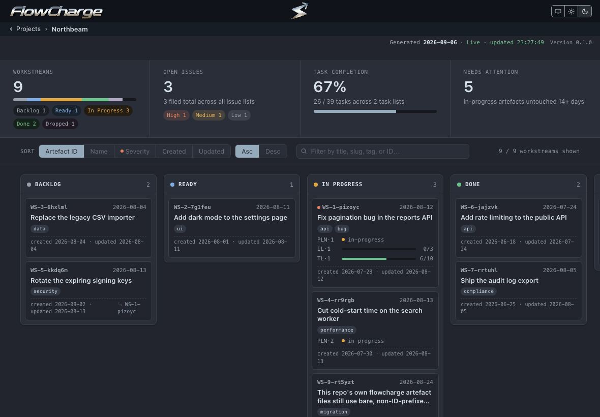

```
███████╗██╗      ██████╗ ██╗    ██╗ ██████╗██╗  ██╗ █████╗ ██████╗  ██████╗ ███████╗
██╔════╝██║     ██╔═══██╗██║    ██║██╔════╝██║  ██║██╔══██╗██╔══██╗██╔════╝ ██╔════╝
█████╗  ██║     ██║   ██║██║ █╗ ██║██║     ███████║███████║██████╔╝██║  ███╗█████╗  
██╔══╝  ██║     ██║   ██║██║███╗██║██║     ██╔══██║██╔══██║██╔══██╗██║   ██║██╔══╝  
██║     ███████╗╚██████╔╝╚███╔███╔╝╚██████╗██║  ██║██║  ██║██║  ██║╚██████╔╝███████╗
╚═╝     ╚══════╝ ╚═════╝  ╚══╝╚══╝  ╚═════╝╚═╝  ╚═╝╚═╝  ╚═╝╚═╝  ╚═╝ ╚═════╝ ╚══════╝
```

**FlowCharge is a markdown project-management suite that runs in your agent sessions,
writing every plan, issue and task into your repository to keep the project on
track.**

  



## What it is

FlowCharge is the application. It reads the `flowcharge/` folder in any project and
renders every workstream as a card on a local board: backlog, ready, in progress,
done, dropped. Each card carries its plan, its issues and its task progress. It
installs the FlowCharge Core skill files and tracks their versions. One plain-English
request becomes an ordered pipeline your coding agent runs: investigate, plan, file,
task, execute, commit. One setting decides how much of that comes back to you before
it lands.

This repository holds binaries and documentation only. There is no source to read
here.

## Install

Install FlowCharge with Homebrew, then start it.

```sh
brew install FlowChargeApp/flowcharge/flowcharge
flowcharge
```

Open `http://localhost:4173`, paste the absolute path of a project that holds a
`flowcharge/` folder, and click its tile.
If you would rather download the binary directly, every release is on the
[Releases page](https://github.com/FlowChargeApp/flowcharge/releases), for macOS on
Apple Silicon and Intel and Linux x64.
The binary is self-contained. Nothing else needs installing to run it.

## Try it

Install FlowCharge Core into your coding tool from the Manage integrations screen.
Then give your agent these prompts in order, one at a time or all at once.

```
Create a workstream to add a CSV export to the reports page.
Write up a plan
Open tasks
Execute all tasks, committing after each task.
List what is in flight
```

Watch the board while your agent works. It updates on its own, and every card, issue
and task on it comes from the files your agent just wrote.

## How it works

Your coding agent keeps a `flowcharge/` folder in each project, with one sub-folder
per workstream.
Each sub-folder holds that workstream's plan, issues and tasks as markdown, with the
status in the frontmatter.
FlowCharge reads those files fresh on every request, so the board is never older than
the files.
Read the full model in
[FlowCharge Core](https://github.com/FlowChargeApp/flowcharge-core).

## Works with

- Claude Code, Cursor, Windsurf and OpenCode: the coding tools FlowCharge installs
  Core into.
- macOS on Apple Silicon and Intel and Linux x64, each as one self-contained
  binary (Windows version coming soon).
- Any project that holds a `flowcharge/` folder, whatever the language.

## The other half

[FlowCharge Core](https://github.com/FlowChargeApp/flowcharge-core) is the free,
open-source skill suite that does the work FlowCharge shows. Each runs on its own:
Core needs no application, and FlowCharge reads any `flowcharge/` folder, whoever
wrote it.

---

FlowCharge is free to use, and its source is not published.
To report a vulnerability, see [SECURITY.md](SECURITY.md).
Copyright © 2026 Anthony Koukoullis. All rights reserved.
